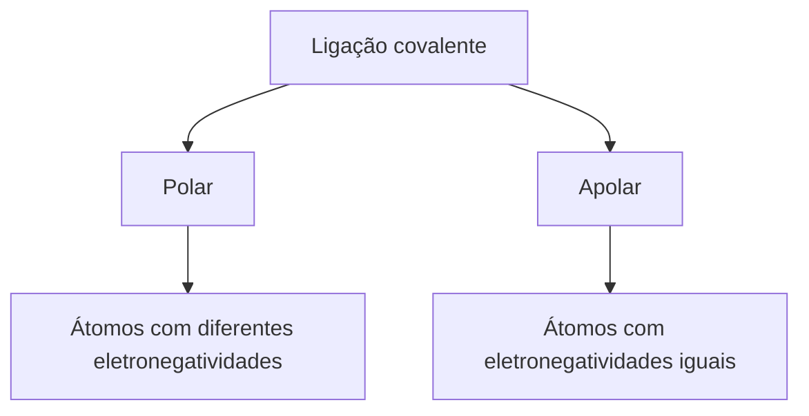
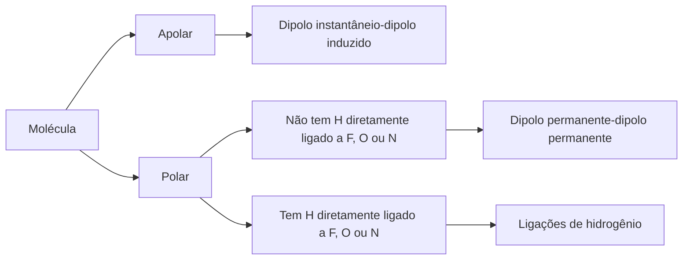

Toda **matéria**, **orgânica** ou **inorgânica**, é composta por pequenas **partículas** chamadas **átomos**. Existem 109 tipos de **átomos** conhecidos, dos quais 89 são naturais e 20 são produzidos em laboratório. Cada tipo de **átomo** é um **elemento químico**.

Segundo o **modelo atômico** atual, todos os **átomos** possuem um núcleo denso cercado por **elétrons**. O núcleo, que contém a maior parte da **massa** do **átomo**, é formado por **prótons** e **nêutrons**. **Prótons** têm carga positiva (+1), enquanto **nêutrons** são neutros. **Elétrons** têm carga negativa (-1) e **massa** muito menor que **prótons** e **nêutrons**, contribuindo pouco para a **massa** total do **átomo**.

```ad-tip
**Nêutron** é uma **partícula** sub atômica sem **carga elétrica** e de **massa** praticamente igual à do **próton**. Já o **eletron** tem uma diferença de **massa** é tão grande com estes que, em cálculos químicos, a **massa** dos **elétrons** é geralmente ignorada.
```

Um **átomo** é eletricamente neutro, com o mesmo número de **prótons** e **elétrons**, neutralizando as cargas. Cada **elemento químico** é identificado pelo número de **prótons** no núcleo, chamado **número atômico**. Por exemplo, o **hidrogênio** (H) tem um **próton** e **número atômico** 1, enquanto o **carbono** (C) tem seis **prótons** e **número atômico** 6.

![[bio-atomo-resumo.png]]

```ad-info
Os **átomos** de um **elemento químico** podem formar uma ou mais **ligações** com outros **átomos**. O número de **ligações** que um **átomo** pode formar é chamado de **valência química**. Por exemplo, o **hidrogênio** (H) pode formar apenas uma **ligação**, sendo **monovalente**. O **oxigênio** (O) pode formar duas **ligações**, sendo **bivalente**. O **enxofre** (S) também é **bivalente**, enquanto o **nitrogênio** (N) e o **fósforo** (P) são **trivalentes**. O **carbono** (C) pode formar quatro **ligações**, sendo **tetravalente**.
```

```ad-note
**Átomos** e **moléculas** fazem parte de um mundo microscópico, quase além de nossa capacidade imaginativa. As menores **partículas** de poeira que somos capazes de ver a olho nu são formadas por um número de **átomos** maior do que o número de estrelas em nossa galáxia. Quando alguém observa uma **célula** viva ao microscópio óptico, está observando algo formado por trilhões de **átomos** ou mais.

Só para você ter uma noção de como os **átomos** são pequenos, considere os seguintes dados: se conseguíssemos enfileirar **átomos** de **césio**, de **ouro** ou de **hidrogênio** até que a fileira atingisse 1 cm de comprimento, seriam necessários aproximadamente 19 milhões de **átomos** de **césio**, 35 milhões de **átomos** de **ouro** ou 134 milhões de **átomos** de **hidrogênio**!
```
### Número atômico, número de massa e elemento químico
No estudo da Química, são de fundamental importância as definições:
	a) **Número atômico** (Z) é o número de **prótons** presentes no núcleo de um **átomo**.
	b) **Número de massa** (A) é a soma do número de **prótons** (Z) e de **nêutrons** (N) presentes no núcleo de um **átomo**.

```ad-tip
 A fórmula matemática é: A = Z + N.
```

Ao representar um **átomo**, os químicos convencionaram escrever o **número atômico** na parte inferior esquerda do símbolo e o **número de massa** na parte superior esquerda. Assim, por exemplo:

- ¹²₆C representa um **átomo** do **elemento químico** **carbono** com 6 **prótons**, 6 **elétrons** e 6 **nêutrons**.
- ²³₁₁Na representa um **átomo** do **elemento químico** **sódio** com 11 **prótons**, 11 **elétrons** e 12 **nêutrons**.
- ³⁷₁₇Cl representa um **átomo** do **elemento químico** **cloro** com 17 **prótons**, 17 **elétrons** e 20 **nêutrons**.

```ad-note
Nesses casos os **prótons** e **elétrons** estão em mesmo número porque os **átomos**, em seu estado neutro, não possuem carga elétrica líquida. Isso acontece porque:

- **Prótons** têm carga positiva (+1)
- **Elétrons** têm carga negativa (-1)
```
### Isótopos
**Isótopos** são dois ou mais **átomos** que possuem o mesmo **número atômico** (Z) e diferentes **números de massa** (A). O **hidrogênio** é o **elemento químico** com **número atômico** 1. Será que todos os **átomos** de **hidrogênio** que existem na natureza são exatamente iguais? A resposta é não.

![[quim-atomo-isobaro.png]]

Os três possuem em comum o **número de prótons** (Z) (e, considerando os eletricamente neutros, também o número de **elétrons**). A diferença está no número de **nêutrons**.

```ad-note
Uma vez que possuem o mesmo **número atômico**, são **átomos** de um mesmo **elemento químico**: o **hidrogênio**. Dizemos que esses três **átomos** são **isótopos**.
```

```ad-summary
#### Isóbaros e Isótonos
**Isóbaros** são dois ou mais **átomos** que possuem o mesmo **número de massa** (A) e diferentes **números atômicos** (Z).

**Isótonos** são dois ou mais **átomos** que possuem o mesmo número de **nêutrons** (N) e diferentes **números atômicos** (Z) e **número de massa** (A).
```
#### Exercícios

1 - **Dados os átomos:**

- Átomo A: Z = 8, A = 16
- Átomo B: Z = 8, A = 17
- Átomo C: Z = 9, A = 17

**a)** Quais são isótopos do mesmo elemento?  
**b)** Justifique sua resposta.

> [!info]- Resposta  
> #### Explicação
a) Os **átomos** A e B são **isótopos**.  
b) **Isótopos** são **átomos** do mesmo elemento (mesmo Z) com diferentes **números de massa** (A).
>- A e B têm Z = 8 (**oxigênio**), mas A = 16 e A = 17.
> - C tem Z = 9 (**flúor**), logo não é **isótopo** de A ou B.

2 - **Dados os átomos:**
- ¹²₆C (Carbono-12)
- ¹⁴₇N (Nitrogênio-14)

a) Quantos nêutrons cada um possui?  
b) Eles são isótonos?  

> [!info]- Resposta
> #### Explicação  
> a) ¹²₆C: **Nêutrons** = A - Z = 12 - 6 = 6 
>  ¹⁴₇N: **Nêutrons** = 14 - 7 = 7  
> b) Não são **isótonos**, pois têm números diferentes de **nêutrons** (6 ≠ 7).  

3 - **Dados os átomos:**
- ⁴⁰₁₈Ar (Argônio-40)
- ⁴⁰₂₀Ca (Cálcio-40)

**Eles são isóbaros? Justifique.**

> [!info]- Resposta  
> #### Explicação
Sim, são **isóbaros**. Os **isóbaros** possuem o mesmo **número de massa** (A) e diferentes **números atômicos** (Z).  Ambos têm A = 40, mas Z = 18 (Ar) e Z = 20 (Ca).

4 - **Considere os átomos a seguir:  ₁₉⁴⁰X ₂₀⁴⁰Y ₄₀⁹¹ Z ₁₉³⁹R ₃₉⁹⁰S ₄₀⁹⁰T**  
  
a) Quais são isótopos?   
b) Quais são isóbaros?   
c) Quais são isótonos?   
d) Quais pertencem ao mesmo elemento químico?   
e) Quais deveriam estar representados usando o mesmo símbolo químico?

> [!info]- Resposta  
> #### Explicação
**a)** Os **elementos químicos** que são **isótopos**, são: ₁₉⁴⁰X e ₁₉³⁹R; ₄₀⁹¹Z e ₄₀⁹⁰T.  
**b)** Os **elementos químicos** que são **isóbaros**, são: ₁₉⁴⁰X e  ₂₀⁴⁰Y; ₃₉⁹⁰S e ₄₀⁹⁰T.  
**c)** Os **elementos químicos** que são **isótonos** são:  ₂₀⁴⁰Y e ₁₉³⁹R (possuem número igual de 20 **nêutrons**); e ₄₀⁹¹Z e ₃₉⁹⁰S (possuem número igual de 51 **nêutrons**).  
**d)** Os elementos ₁₉⁴⁰X e ₁₉³⁹R, porque possuem o mesmo **número atômico** de valor igual à 19 **prótons**.  E os elementos ₄₀⁹¹Z e ₄₀⁹⁰T, porque possuem o mesmo **número atômico** de valor igual à 40 **prótons**.  
**e)** Deveriam estar representados usando o mesmo símbolo químico os elementos: X e R, Z e T.

5 - **O silício, elemento químico mais abundante na natureza depois do oxigênio, tem grande aplicação na indústria eletrônica. Por outro lado, o enxofre é de importância fundamental na obtenção do ácido sulfúrico. Sabendo se que o átomo z= 14 a=28 Si é isótono de uma das variedades isotópicas do enxofre, S z=16 , pode-se afirmar que este átomo tem número de massa igual a?**

a) 14.
b) 16.
c) 30.
d) 32.
e) 34.

> [!info]- Resposta  
> **Resposta correta: c) 30.**
> #### Explicação
> O **silício**-28 tem 14 **nêutrons** (28 - 14).  O **isótono** de **enxofre** deve ter os mesmos 14 **nêutrons**. Como o **enxofre** tem Z = 16, seu **número de massa** será 16 (**prótons**) + 14 (**nêutrons**) = 30.

6 - **Alguns estudantes de química, avaliando seus conhecimentos relativos a conceitos básicos para o estudo do átomo, analisam as seguintes afirmativas:** 

I. Átomos isótopos são são aqueles possuem mesmo número atômico e número de massa diferente.  
II. O número atômico de um elemento correspondente à soma do número do número de prótons com o de nêutrons.  
III. O número de massa de um átomo, em particular, é a soma do número de prótons com o de elétrons.  
IV. Átomos isóbaros são aqueles que possuem números atômicos diferentes e mesmo número de massa.  
V. Átomos isótonos são aqueles que apresentam número atômicos diferentes, números de massa diferentes e mesmo número de nêutrons.  
  
**Esses estudantes concluem, corretamente, que as afirmativas verdadeiras são as indicadas por:**  
  
a) I, II e V  
b) I, IV e V 
c) II e III
d) II, III e V 
e) II e V

> [!info]- Resposta  
>**Resposta correta:** **b) I, IV e V****
> #### Explicação
>  I. Correta, **isótopos** são **átomos** do mesmo elemento (mesmo Z) com diferentes **números de massa** (A). Ex: Carbono-12 e Carbono-14.
 II.  Incorreta, o **número atômico** (Z) é apenas o número de **prótons**. A soma de **prótons** e **nêutrons** é o **número de massa** (A).  Z = **prótons**; A = **prótons** + **nêutrons**. 
III. Incorreta, o **número de massa** (A) é a soma de **prótons** e **nêutrons**, não **elétrons**. **Elétrons** não contribuem significativamente para a massa. 
IV. Correta, **isóbaros** são **átomos** de elementos diferentes (Z diferente) com mesmo A. Ex: Potássio-40 (Z=19) e Cálcio-40 (Z=20). 
V. Correta , **isótonos** compartilham o mesmo N (**nêutrons**), mas diferem em Z e A. | Ex: Carbono-14 (N=8) e Oxigênio-16 (N=8). 

7 - **A densidade da agua comum, H2O, e da agua pesada, D2O, medidas nas mesmas condições de pressão e temperatura, são diferentes. Isso ocorre porque os átomos de hidrogênio e deutério diferem quanto ao:** 

a) Número atômico.  
b) Número de elétrons.  
c) Número de nêutrons.  
d) Número de oxidação.  
e) Número de prótons.

> [!info]- Resposta  
>**Resposta correta: c) Número de nêutrons.**
> #### Explicação
> a)/e) Erradas, ambos têm Z=1 (mesmo número de **prótons**).
> b) Errada, em **átomos** neutros, ambos têm 1 **elétron**.
> c) Correta, mesmo **átomo** se diferenciando apenas a sua **massa atômica**, incrementada pelo número de **nêutrons**.
> d) Errada, a **oxidação** não muda porque ambos estão ligados a 1 **oxigênio**.

8 - **A água pesada é quimicamente formada por átomos de hidrogênio e oxigênio, tal como a água comum. No entanto, a água pesada contém predominantemente átomos de ​²​H (deutério) e ​¹⁶​O. Ela é utilizada em reatores nucleares para moderar nêutrons emitidos em reações nucleares que ocorrem no núcleo do reator e geram energia térmica. Os átomos de hidrogênio e deutério são classificados como `_________` . Em uma molécula de água pesada, o número total de nêutrons é igual a `_______`. As lacunas são preenchidas correta e respectivamente por**  
  
a) isômeros … 10  
b) isômeros … 18  
c) isótopos … 10  
d) isótopos … 18  
e) isótopos … 20

> [!info]- Resposta  
>**Resposta correta: c) isótopos … 10**
> #### Explicação
> a) Errada, **isômeros** são compostos com mesma **fórmula molecular** mas arranjos diferentes.
> b) Errada, erro duplo (**isômeros** + cálculo incorreto).
> c) Correta, possuem mesmo **número atômico** (Z=1, mesmo **número de prótons**), diferem no número de **nêutrons**: ¹H: 0 **nêutron**; ²H: 1 **nêutron**. 
> 
> Cálculo de **nêutrons** em D₂O (água pesada):
> 
> 2 **átomos** de **deutério** (²H): 1 **nêutron** cada → 2 × 1 = 2 **nêutrons**
> 1 **átomo** de **oxigênio**-16 (¹⁶O): 8 **nêutrons** → 8 **nêutrons**
> Total = 2 (dos **deutérios**) + 8 (do **oxigênio**) = 10 **nêutrons**
> 
> d) Errada, cálculo errado (considerou erroneamente o **oxigênio** como tendo 16 **nêutrons**).
> e) Errada, cálculo completamente equivocado.

9 - **Considere as seguintes informações sobre os átomos A,B e C.** 

I. A e B são isótopos.  
II. A e C são isótonos.  
III. B e C são isóbaros.  
IV. O número de massa de A é igual a 55.  
V. A soma dos números de de prótons de A,B e C é 79.  
VI. A soma dos números de nêutrons de A,B e C é 88.  

**Determine os números atômicos e de massa de A,B e C.**

> [!info]- Resposta  
> #### Explicação  
> - **Isótopo** = Mesmo número de prótons  
> - **Isótono** = Mesmo número de nêutrons  
> - **Isóbaro** = Mesmo número de massa (P + N)  
>  
> Tabela Inicial
>  
> |               | A  | B  | C    |
> |--------------|----|----|------|
> | **Prótons**  | x  | x  | z - y  |
> | **Nêutrons** | y  | z - x  | y  |
> | **Massa Atômica** (P + N) | 55 | z  | z  |
>  
> Equações
>  
> $$
> x + y = 55
> $$  
>  
> $$
> 2x + z - y = 79
> $$  
>  
> $$
> y + z - x + y = 88 \Rightarrow 2y + z - x = 88
> $$  
>  
> Resolvendo para x e y
>  
> $$
> x = 55 - y
> $$  
>  
> Substituindo em \( 2x + z - y = 79 \):  
>  
> $$
> 2(55 - y) + z - y = 79
> $$  
>  
> $$
> 110 - 2y + z - y = 79
> $$  
>  
> $$
> -3y + z = 79 - 110
> $$  
>  
> $$
> z = -31 + 3y
> $$  
>  
> Substituindo em \( 2y + z - x = 88 \):  
>  
> $$
> 2y - 31 + 3y - 55 = 88
> $$  
>  
> $$
> 6y = 88 + 86
> $$  
>  
> $$
> y = 29
> $$  
>  
> Calculando \( x \):  
>  
> $$
> x = 55 - 29 = 26
> $$  
>  
> Calculando \( z \):  
>  
> $$
> 2(26) + z - 29 = 79
> $$  
>  
> $$
> 52 + z = 108
> $$  
>  
> $$
> z = 56
> $$  
>  
> **Solução Final**  
>  
> |               | A  | B  | C  |
> |--------------|----|----|----|
> | **Prótons**  | 26  | 26  | 27  |
> | **Nêutrons**  | 29  | 30  | 29  |
> | **Massa Atômica** (P+N)  | 55  | 56  | 56  |

## Cargas elétricas, atração e repulsão
Atritando um bastão de vidro em um pedaço de lã, pendurando esse bastão com o auxílio de um barbante e, logo após, aproximando-o do pedaço de lã, notaremos que ambos se atraem. Porém, se em seguida friccionarmos outro bastão de vidro em outro pedaço de lã e aproximarmos esse bastão daquele que está suspenso, notaremos que ambos se repelem.

As observações relatadas acima demonstram a ocorrência de fenômenos elétricos. Para justificar tal ocorrência, os cientistas consideram que, ao atritarmos ambos os materiais (lã e vidro), o bastão de vidro passa a ser portador de **carga elétrica positiva** (por uma convenção), e a lã, portadora de **carga elétrica negativa** (também por uma convenção). Muitos materiais, quando atritados em outros, ficam eletrizados, ou seja, adquirem **carga elétrica**.

```ad-important
Por meio de experiências de eletrização é possível concluir que:

- **Cargas elétricas** de sinais diferentes se atraem.
- **Cargas elétricas** de sinais iguais se repelem.
```

Essas conclusões estão de acordo com o fato de a lã e o vidro, eletrizados com cargas de diferentes sinais, se atraírem, e os dois bastões de vidro, eletrizados com cargas de sinais iguais, se repelirem.

Essa experiência ilustra que a matéria (no caso, o vidro e a lã) toma parte em fenômenos elétricos, ou seja, a matéria possui uma natureza elétrica. 

```ad-note
Outras evidências da natureza elétrica da matéria são as seguintes:
- Se atritarmos um bastão de vidro em um pedaço de lã e o aproximarmos de pequenos pedaços de papel, veremos que estes serão atraídos pelo bastão.
- Se friccionarmos um bastão de vidro em um pedaço de lã e o aproximarmos de um pequeno fio de água corrente, notaremos que este será desviado na direção do bastão.
```
## Íons
Entre as **partículas** que formam o **átomo**, os **elétrons** possuem **carga negativa** e os **prótons**, **carga positiva**. Assim, se o número de **elétrons** for igual ao número de **prótons**, a carga total do **átomo** será nula, pois a **carga positiva** de cada **próton** será compensada pela **carga negativa** de um **elétron** correspondente. Dizemos que um **átomo** nessa situação está eletricamente neutro.

Quando um **átomo** está eletricamente neutro, ele possui **prótons** e **elétrons** em igual número. Os químicos descobriram que, em determinadas circunstâncias, os **átomos** podem ganhar ou perder **elétrons**. Quando isso acontece, sua carga total deixa de ser zero, ou seja, o **átomo** deixa de ser eletricamente neutro e passa a ser dotado de **carga elétrica**. Dizemos que o **átomo** se transformou em um **íon**.

Portanto, quando um **átomo** eletricamente neutro perde ou recebe **elétrons**, ele se transforma em um **íon**. Quando um **átomo** eletricamente neutro recebe **elétrons**, passa a ficar com excesso de **cargas negativas**, ou seja, transforma-se em um **íon negativo**. Já, se um **átomo** eletricamente neutro perde **elétrons**, passa a apresentar um excesso de **prótons**, isto é, transforma-se em um **íon positivo**.

```ad-tip
O **íon negativo** é chamado de **ânion**, e o **íon positivo** é chamado de **cátion**.
```

![[quim-atomo-ions.png]]

Os **íons monovalentes**, isto é, que possuem apenas uma **carga elétrica**, são representados colocando-se um sinal de mais (+) ou de menos (−) no canto superior direito do símbolo. O sinal de mais indica um **cátion** e o de menos, um **ânion**.

```ad-info
Para representar os **íons bivalentes** (com 2 cargas), **trivalentes** (com 3 cargas) e **tetravalentes** (com 4 cargas), deve-se colocar um número que indica a quantidade de cargas antes do sinal de mais ou de menos.
```

Assim, estes são alguns exemplos de íons:
- **Ânions monovalentes:** F⁻, Cl⁻, Br⁻, I⁻
- **Cátions monovalentes:** Li⁺, Na⁺, K⁺, Ag⁺, Cu⁺
- **Ânions bivalentes:** O²⁻, S²⁻, Se²⁻
- **Cátions bivalentes:** Mg²⁺, Ca²⁺, Ba²⁺, Fe²⁺, Cu²⁺
- **Ânions trivalentes:** N³⁻, P³⁻
- **Cátions trivalentes:** Al³⁺, Fe³⁺, Cr³⁺
- **Cátions tetravalentes:** Sn⁴⁺, Pb⁴⁺
### Exercícios

1 - **O íon ₅₃I⁻ é importante para o funcionamento normal da glândula tireoide e, por isso, deve estar presente, em quantidade adequada, na dieta humana. Quantos prótons e quantos elétrons há na constituição desse ânion?** 


> [!info]- Resposta  
> #### Explicação
> Um átomo neutro de iodo transforma-se no ânion monovalente quando recebe 1 elétron.
> $$
{}^{53}I
\begin{cases}
\text{53 prótons} \\
\text{53 elétrons}
\end{cases}
\xrightarrow{\text{Acrescentando 1 elétron}}
{}^{53}I^-
\begin{cases}
\text{53 prótons} \\
\text{54 elétrons}
\end{cases}
>  $$
> Portanto, o íon ₅₃I⁻ tem 53 prótons e 54 elétrons.

2 - **Um isótopo de um elemento metálico tem número de massa 65 e 35 nêutrons no núcleo. O cátion derivado desse isótopo tem 28 elétrons. A carga desse cátion é:**

a) -1.
b) +3.
c) 0.
d) +1.
e) +2.

> [!info]- Resposta  
> **Resposta correta: e) +2.**
> #### Explicação
> Primeiro, precisamos descobrir o número de **prótons**, sabemos que o **número de massa** do elemento é 65 e 35 **nêutrons**. Dessa forma:
> $$
A = N + P \Rightarrow 65 = 35 - P \Rightarrow P = 30 
>$$
 Isso significa que o **cátion** perdeu 2 **elétrons**, resultando em uma carga +2.

3 - **Analise este quadro, em que se apresenta o número de prótons, de nêutrons e de elétrons de quatro espécies químicas:**

| Espécie | Número de prótons | Número de nêutrons | Número de elétrons |
|---------|-------------------|--------------------|--------------------|
| I       | 1                 | 0                  | 0                  |
| II      | 9                 | 10                 | 10                 |
| III     | 11                | 12                 | 11                 |
| IV      | 20                | 20                 | 18                 |
Considerando-se as quatro espécies apresentadas, é INCORRETO afirmar que:

a) I é o cátion H⁺.  
b) II é o ânion F⁻.  
c) III tem número de massa 23.  
d) IV é um átomo neutro.

> [!info]- Resposta  
> **Resposta correta: d)**
> #### Explicação
> a) Correta, pois I realmente é um cátion H⁺, visto que seu número de prótons se difere de +1 dos elétrons.
> b) Correta, pois II é um ânion F⁻, visto que seu número de prótons se difere em -1 dos elétrons.
> c) Correta, pois o número de massa é realmente 23, 11 + 12 = 23.
> d) Errada, não é um átomo neutro é um íon positivo. Um átomo neutro teria 20 elétrons; como perdeu 2 elétrons, é um cátion Ca²⁺

4 - **Espécies químicas simples que apresentam o mesmo número de elétrons são chamadas de isoeletrônicas. Assim, entre Mg, Na⁺, Cl⁻, S, K⁺ e Ar, são isoeletrônicas:**  

(Dados: números atômicos — Na = 11; Mg = 12; S = 16; Cl = 17; Ar = 18; K = 19)

a) Cl⁻ e S.  
b) K⁺, Ar e Cl⁻.  
c) Na⁺ e Mg.  
d) Na⁺ e Cl⁻.  
e) Na⁺ e K²⁺.

> [!info]- Resposta  
> **Resposta correta: b)**
> #### Explicação
a) Cl⁻ (18) e S (16) NÃO são **isoeletrônicas**.  
b) K⁺ (18), Ar (18) e Cl⁻ (18) SIM, são **isoeletrônicas**.  
c) Na⁺ (10) e Mg (12) NÃO são **isoeletrônicas**.  
d) Na⁺ (10) e Cl⁻ (18) NÃO são **isoeletrônicas**.  
e) Na⁺ (10) e K²⁺ (17) NÃO são **isoeletrônicas**.

5 - **O átomo ⁵²M apresenta 28 nêutrons.  Assim, o íon M³⁺ é isoeletrônico ao átomo:**

a) ²⁰Ca  
b) ²²Ti  
c) ²¹Sc  
d) ²³V  
e) ²⁵Mn

> [!info]- Resposta  
> **Resposta correta: c) ²¹Sc**
> #### Explicação
> Precisamos descobrir o número de prótons, sabendo que o o número de massa é 52 e o número de nêutrons é 28, utilizamos a seguinte fórmula:
>
> $$
A = P + N \Rightarrow 52 = P + 28 \Rightarrow P = 24
> $$
> Com o átomo M está eletricamente estável podemos concluir que ele possuí 24 elétrons.
> O íon M³⁺ perde 3 elétrons, ficando com 21 no total, ou seja alternativa c).

6 - **O acelerador de partículas é um sistema utilizado para estudos da estrutura da matéria e física nuclear. Em um experimento realizado no acelerador, foram projetadas partículas que, ao colidirem com uma placa, geraram um tipo de espécie que apresenta 30 prótons, 28 nêutrons e 29 elétrons. Pode-se afirmar que essa espécie é um:**  

a) cátion monovalente com número de massa igual a 59.  
b) ânion bivalente com número de massa igual a 58.  
c) ânion monovalente com número de massa igual a 57.  
d) cátion monovalente com número de massa igual a 58.  
e) cátion monovalente com número de massa igual a 57.

> [!info]- Resposta  
> **Resposta correta: d)**
> #### Explicação
Nesse caso, temos um átomo que possui 30 **prótons** e 28 **nêutrons**, logo, Z = 30 e uma massa de:
>
> $$
> \begin{aligned}
> A &= P + N \\
> A &= 30 + 28 \\
> A &= 58
> \end{aligned}
> $$
>
>
Como ele possui 29 **elétrons**, um a menos que o número de prótons, o mesmo possui uma carga positiva, sendo assim, um cátion monovalente.

## Modelo atômico de Dalton
A palavra "átomo" tem origem grega e significa "indivisível". Este termo surgiu com filósofos da Grécia Antiga que, através de argumentos filosóficos, propuseram que tudo na natureza é composto por partículas extremamente pequenas e indivisíveis - os átomos.

John Dalton posteriormente desenvolveu uma teoria atômica mais elaborada. Em linguagem moderna, sua teoria propõe que todas as substâncias são formadas por átomos. Átomos de um mesmo elemento químico são idênticos em características como tamanho e massa, enquanto átomos de elementos diferentes possuem propriedades distintas. Substâncias simples contêm átomos de apenas um elemento químico, enquanto substâncias compostas combinam átomos de dois ou mais elementos em proporções fixas. Dalton considerava os átomos como esferas rígidas e indivisíveis que não podem ser criados nem destruídos, apenas recombinados durante reações químicas.
### Exercícios
1 - **Dalton, na sua teoria atômica, propôs entre outras hipóteses que:**

a) “os átomos são indivisíveis”.
b) “os átomos de um determinado elemento são idênticos em massa”.

**À luz dos seus conhecimentos atuais, quais as críticas que podem ser formuladas a cada uma dessas hipóteses?**

> [!info]- Resposta  
> #### Explicação
> a) Hoje, sabemos que os átomos não são indivisíveis, mas podem ser divididos em **partículas** ainda menores como prótons, nêutrons e elétrons;
> b) Embora os átomos de um mesmo elemento de fato possam ter a mesma massa atômica, também há a possibilidade deles terem diferentes números de massa, pois eles podem ter diferentes números de nêutrons, o que caracteriza a existência dos isótopos.
## Modelo atômico de Rutherford
Á medida que novas evidências surgem, teorias e modelos têm, muitas vezes, de ser aperfeiçoados ou substituídos por outros. E foi isso que aconteceu com a **Teoria de Dalton** e seu modelo.

Nesse sentido, Ernest Rutherford realizou um experimento que descartou de vez o **modelo atômico de Dalton**. O raciocínio de Rutherford foi extremamente simples. Imagine que alguém atirasse com uma metralhadora em um caixote de madeira fechado, cujo conteúdo fosse desconhecido. Se as balas ricocheteassem, não atravessando o caixote, concluiríamos que dentro dele deveria haver algum material como concreto ou ferro maciço. Mas, se as balas o atravessassem, chegaríamos à conclusão de que ele deveria estar vazio ou conter materiais pouco densos, como isopor ou serragem.

Porém, se parte das balas passasse e parte ricocheteasse, concluiríamos que materiais dos dois tipos deveriam estar presentes dentro do caixote. Quanto mais balas o atravessassem, menos material pesado deveria existir em seu interior. 

É óbvio que, para descobrir o que há dentro de um caixote, seria mais sensato abri-lo em vez de atirar nele. Com o **átomo**, porém, não acontece o mesmo, já que não é possível enxergá-lo. Nesse caso, faz sentido “atirar” nele para tentar descobrir algo sobre sua estrutura interna.

Rutherford atirou numa finíssima folha de **ouro**, cuja espessura se estima em torno de trezentos ou trezentos e cinquenta **átomos**.  A “metralhadora” usada por ele lançava pequenas **partículas** portadoras de **carga elétrica positiva**, chamadas de **partículas alfa** (α). Essas **partículas** são emitidas por certos **elementos radioativos**, como o **polônio**.

![[quim-rutherford-2.png]]

Para saber se essas “balas” atravessavam ou eram desviadas, ele usou uma tela feita com um material apropriado (fluorescente) que emite uma luminosidade instantânea quando atingida por uma **partícula alfa**. 

![[quim-rutherford.png]]

A experiência mostrou que a grande maioria das **partículas alfa** atravessava a folha. Apenas algumas poucas eram desviadas. Assim, os **átomos** não poderiam ser maciços, pois parte das **partículas alfa** conseguiu atravessá-los.
### Características do átomo no modelo de Rutherford
Os resultados da experiência sobre espalhamento de **partículas alfa** permitiram a Rutherford concluir que:
	a) o **átomo** não é maciço, apresentando mais espaço vazio do que preenchido;
	b) a maior parte da massa do **átomo** se encontra em uma pequena região central (que chamaremos de núcleo) dotada de **carga positiva**, onde estão os **prótons**;
	c) na região ao redor do núcleo (que chamaremos de **eletrosfera**) estão os **elétrons**, muito mais leves que os **prótons**;
	d) a contagem do número de **partículas** que atravessavam e que eram desviadas, repelidas pela **carga positiva** do núcleo, permitiu fazer uma estimativa de que o raio de um **átomo** de **ouro** (núcleo e eletrosfera) é cerca de dez mil a cem mil vezes maior que o raio do núcleo.

![[quim-rutherford-3.png]]
### Exercícios

1 - **Rutherford, ao fazer incidir partículas radioativas em lâmina metálica de ouro, observou que a maioria das partículas atravessava a lâmina, algumas desviavam e poucas refletiam. Assinale, dentre as afirmações a seguir, aquela que não reflete as conclusões de Rutherford sobre o átomo.**

a) Os átomos são esferas maciças e indestrutíveis.
b) No átomo, há grandes espaços vazios.
c) No centro do átomo, existe um núcleo pequeno e denso.
d) O núcleo do átomo tem carga positiva.
e) Os elétrons giram ao redor do núcleo para equilibrar a carga positiva.

> [!info]- Resposta  
> **Resposta Correta:** **a)**  
> #### Explicação
>No experimento, **Rutherford** bombardeou uma fina lâmina de **ouro** com **partículas alfa** (α) e observou que a maioria das **partículas** atravessavam a lâmina sem desvio, ou seja, **átomos** têm grandes espaços vazios, já algumas **partículas** desviavam levemente do núcleo com **carga positiva** (repeliu as **partículas** α, também positivas) e pouquíssimas **partículas** refletiam de volta o núcleo **muito pequeno e denso**.  
>   
> #### Por que as outras estão erradas?  
> - a) Errado, NÃO reflete as conclusões de **Rutherford**. Esse era o modelo de **Thomson**, que Rutherford refutou ao mostrar que o **átomo** é majoritariamente vazio e tem um núcleo central.)
> - b) Certo, baseada na maioria das partículas que atravessaram a lâmina.
> - c) Certo, poucas **partículas** refletiram, indicando um núcleo minúsculo e massivo.
> - d) Certo, desvios ocorreram devido à repulsão entre **cargas positivas**.
> - e) Certo, Rutherford sugeriu **órbitas eletrônicas**, mas sem detalhar o equilíbrio de cargas; essa ideia foi refinada por **Bohr** mais tarde.

2 - **Considere os modelos atômicos de:** 

**I. Dalton;** 
**II. Thomson;** 
**III. Rutherford.**

a) Qual deles foi proposto baseado nos resultados da medida da massa dos participantes de reações químicas?
b) Qual introduziu a natureza elétrica da matéria? 
c) Qual apresenta a matéria como sendo descontínua?
d) Qual é o mais recente?

> [!info]- Resposta  
> #### Explicação
> 
> a) O **modelo atômico de Dalton** foi proposto pelo cientista, em 1808. De acordo com a **teoria atômica de Dalton**, a **matéria** era formada por **átomos** indivisíveis e indestrutíveis, comparados a uma bola de bilhar.
>
> b) O **modelo atômico de Thomson** foi proposto em 1897 e ficou conhecido como pudim de passas. Para **Thomson** o **átomo** apresentava natureza elétrica e era divisível.
>
> c) O **modelo atômico de Rutherford** foi proposto em 1911, também é chamado de modelo planetário do **átomo**. Foi a partir desse modelo que foram introduzidas as **cargas elétricas** no interior do **átomo**. Para **Rutherford**, o **átomo** possuía um núcleo, onde os **prótons** e os **elétrons** estariam presentes.
>
> d) **Niels Bohr** propôs um modelo que se baseou no modelo de **Rutherford**, apenas aprimorando-o, por isso é chamado de **modelo atômico de Rutherford-Bohr**. De acordo com esse modelo, os **elétrons** não se movem aleatoriamente ao redor do núcleo, mas sim em órbitas circulares, onde cada órbita apresenta um nível de energia para cada **elétron** de um **átomo**.

3 -**Julgue se a afirmação é certa ou errada: “No modelo de Rutherford, a maior parte da massa do átomo se concentrava na eletrosfera, onde os elétrons giravam em órbitas ao redor do núcleo, em um modelo similar ao planetário.”**

> [!info]- Resposta  
> **Resposta Correta:** **Errado**  
> #### Explicação
> **Rutherford** acreditava na concentração de massa no **núcleo** (não na eletrosfera). No seu experimento **Rutherford** concluiu que quase toda a massa do **átomo** está no núcleo, devido à reflexão de partículas alfa. 
> 
> Modelo planetário (correto) × Local da massa (incorreto) A comparação com o sistema solar ("modelo planetário") está correta: **elétrons** giram ao redor do núcleo, como planetas ao redor do Sol. **Porém**, no sistema solar, a **massa** está concentrada no Sol (núcleo), não nos planetas (**eletrosfera**). A afirmação inverte essa lógica.

4 - **Rutherford bombardeou uma fina lâmina de ouro (0,0001 mm de espessura) com partículas “alfa”, emitidas pelo Polônio (Po) contido no interior de um bloco de chumbo (Pb), provido de uma abertura estreita, para dar passagem às partículas a por ele emitidas. Envolvendo a lâmina de ouro (Au), foi colocada uma tela protetora revestida de sulfeto de zinco. Observando as cintilações na tela revestida de sulfeto de zinco, Rutherford verificou que muitas partículas a atravessavam a lâmina de ouro sem sofrerem desvio (x), e que poucas partículas a sofriam desvio (y).**

![[quim-exercicio-rutherford.png]]

**Indique a(s) proposição(ões) CORRETA(S).** 

a) Partículas α possuem carga elétrica negativa. 
b) Partículas α sofrem desvio ao colidir com elétrons na eletrosfera dos átomos de Au. 
c) A posição b indica partículas α que passaram próximas aos núcleos. 
d) Na ilustração, não foram indicadas as partículas α que não atravessam a lâmina de ouro. 
e) O núcleo do átomo é infinitamente menor que o tamanho total do átomo.

> [!info]- Resposta  
> #### Explicação
> a) Incorreta, as **partículas alfa** possuem dois **prótons** e dois **nêutrons**, possuindo, portanto, carga positiva. 
> b) Incorreta, como os **elétrons** tem **carga negativa**, não repelem as **partículas alfa**. As mesmas, sofrem desvio do núcleo do **átomo** por possuir também **partículas positivas**.
> c) Correta, a posição b corresponde as **partículas** que sofreram desvio, logo, as que passaram perto do núcleo.
> d) Incorreta, as **partículas** que não atravessam a lamina de ouro são aquelas que sofreram desvio pois colidiram com o núcleo do **átomo**. As mesmas são ilustradas por b. 
> e) Correta, **Rutherford** verificou que a maior parte das **partículas** passou sem sofre desvio. Assim, concluiu-se que o núcleo do **átomo** é muito menor que o tamanho do **átomo**.
> 
## Modelo Atômico de Bohr
O **modelo de Rutherford**, apesar de esclarecer satisfatoriamente os resultados da experiência sobre a dispersão de **partículas alfa**, possuía algumas deficiências, como, por exemplo, a incapacidade de explicar os **espectros atômicos**. Niels Bohr propôs um novo modelo, mais completo, que era suficiente para explicar o **espectro de linhas**.

Em seu modelo, Bohr incluiu uma série de afirmações:
	a) Os **elétrons** nos **átomos** movimentam-se ao redor do núcleo em trajetórias circulares, chamadas de camadas ou níveis (designados por K, L, M, N etc.). Cada um desses níveis tem um valor determinado de **energia**.
	b) Não é permitido a um **elétron** permanecer entre dois desses níveis. Um **elétron** pode passar de um **nível** para outro de maior **energia**, desde que absorva **energia** externa (**ultravioleta**, luz visível, **infravermelho** etc.). Quando isso acontece, dizemos que o **elétron** foi excitado e ocorreu uma **transição eletrônica** (veja a ilustração A).
	c) Para o **elétron** retornar ao nível inicial, é necessária a liberação de **energia** na forma de **ondas eletromagnéticas** (veja a ilustração B), por exemplo, como luz visível ou **ultravioleta**.

![[quim-bohr-1.png]]
Utilizando o **modelo de Bohr**, podem-se explicar os **espectros atômicos**. Primeiramente, os **elétrons** são excitados na lâmpada de gás e, em seguida, ao retornarem aos níveis de menor **energia**, liberam **energia** na forma de luz. Como a cor da luz emitida depende da diferença de **energia** entre os níveis envolvidos na transição (veja a ilustração C), e como essa diferença varia de **elemento** para **elemento**, a luz apresenta uma cor característica para cada **elemento químico**.
![[quim-bohr-2.png]]
```ad-tip
"Absorve sobe, emite desce":  
  - Ao absorver energia, o **elétron** sobe para órbitas mais externas.  
  - Ao emitir energia, desce para órbitas mais internas.
```
### Exercícios

1 - **O modelo atômico de Bohr introduziu importantes inovações em relação aos modelos anteriores. Entre elas, podemos citar:**

a) A matéria é descontínua.
b) Existência de nêutrons.
c) A matéria possui natureza elétrica.
d) Quantização da energia.
e) Explicação da experiência de Rutherford.

> [!info]- Resposta  
> **Resposta Correta:** d)
> #### Explicação
> **Bohr** propôs que os **elétrons** giram em órbitas específicas (níveis de energia quantizados) sem emitir **radiação**. Cada órbita tem uma energia fixa, e o **elétron** só muda de nível ao absorver ou emitir um quantum de energia. Isso explica por que os **átomos** emitem luz em frequências específicas (linhas espectrais).
> #### Analisando as outras alternativas
> a) **Matéria** descontínua é um ideia já presente desde Demócrito (modelos anteriores não negavam isso).  
b) **Nêutrons** foram descobertos por Chadwick em 1932 (após Bohr).  
c) Natureza elétrica já era conhecida (e.g., modelo de Thomson).  
e) Experiência de **Rutherford**, Bohr não a explicou; usou-a como base para seu modelo (o núcleo já era aceito).

2 - **Julgue os itens em verdadeiros (V) ou falsos (F):**

I - O elétron, no nível 3, é mais energético que no nível 1.  
II - A transferência de elétrons do nível 1 para o 3 envolve liberação de energia.  
III - O elétron pode ocupar qualquer nível de energia dentro do átomo.
IV - Quando um elétron retorna de um nível de energia mais baixo para um nível mais elevado, ele libera energia na forma de radiação eletromagnética.

> [!info]- Resposta  
> #### Explicação
> I - Verdadeiro, no **modelo atômico de Bohr**, os **níveis de energia** são quantizados e numerados (n=1, 2, 3...). Quanto mais afastado do núcleo (maior número quântico principal), maior a energia do **elétron**. Portanto, um **elétron** no nível 3 possui mais energia que no nível 1.
> II - Falso, para um **elétron** saltar para um nível mais energético (ex: 1→3), ele precisa ABSORVER energia. A liberação de energia ocorre apenas quando o **elétron** decai para um nível menos energético (ex: 3→1).
> III - Falso, segundo Bohr, os elétrons só podem ocupar **níveis de energia** específicos e quantizados. Não existem níveis intermediários entre as órbitas permitidas.
> IV - Falso, - Há dois erros nesta afirmação:
  >1. O correto seria "de um nível mais elevado para um mais baixo" (não o contrário).
  >2. Quando o **elétron** realmente decai (nível alto para baixo), sim, libera energia como **radiação**.

3 -  (UFRN) Considere o seguinte diagrama, de níveis de energia para o átomo de hidrogênio:

![[quim-exercicio-bohr.png]]

As transições em que ocorre apenas absorção de energia são:
a) I, II, III e IV.
b) III e IV.
c) I e II.
d) I e III.

> [!info]- Resposta  
> **Resposta Correta:** c) I e II.
> #### Explicação
> Para pular um **nível eletrônico**, o **elétron** precisa absorver energia. Logo, pela lógica, como as flechas para cima significam um aumento da energia eletrônica, elas representam transições em que ocorre sua absorção.

4 - **O físico dinamarquês Niels Bohr (1885-1962) enunciou, em 1913, um modelo atômico que relacionou a quantidade de energia dos elétrons com sua localização na eletrosfera. Em relação à energia associada às transições eletrônicas, um elétron, ao absorver energia, pode sofrer a seguinte transição:**

a) da órbita N para a órbita M.  
b) da órbita P para a órbita O.  
c) da órbita L para a órbita K.  
d) da órbita O para a órbita P.  
e) da órbita M para a órbita L.

> [!info]- Resposta  
> **Resposta Correta: d)**
> #### Explicação
> a)/b) Erradas, transição para uma órbita mais interna (perda de energia).
> c)/e) Errada, decaimento (emissão de energia), não absorção.
> d) Correta, O **elétron** absorve energia para saltar para uma órbita mais externa (P está mais distante que O).

5 - **De acordo com o modelo de Bohr, a luz vista durante o teste da chama é emitida:** 

a) quando os átomos se quebram em vários pedaços.
b) pelos elétrons quando são promovidos a níveis de menor energia.
c) pelos elétrons quando retornam, após a excitação, a níveis de menor energia. 
d) quando o núcleo do átomo se quebra em dois pedaços devido ao aquecimento.

> [!info]- Resposta  
> **Resposta Correta: c)**
> #### Explicação
> a)/d) Erradas, falam sobre quebra do **átomo**/núcleo, isso descreve **fissão nuclear**, não o teste da chama. O teste da chama envolve apenas os **elétrons**, não o núcleo.
> b) Errada, **elétrons** não emitem luz quando são PROMOVIDOS (quando absorvem energia). A emissão ocorre apenas quando RETORNAM aos níveis mais baixos.
> c) Correta, essa fenômeno mostra que os níveis de energia são quantizados e as transições eletrônicas ocorrem com absorção/emissão de quantidades específicas de energia.

6 - **Cada elemento químico apresenta um espectro característico, e não há dois espectros iguais. O espectro é o retrato interno do átomo e assim é usado para identificá-lo. Bohr utilizou o espectro de linhas para representar seu modelo atômico, assentado em postulados, cujo verdadeiro é:**  
  
a) ao mudar de órbita ou nível, o elétron emite ou absorve energia superior a diferença de energia entre as órbitas ou níveis onde ocorreu esta mudança  
b) todo átomo possui um certo número de órbitas, com energia constante, chamadas estados estacionários, nos quais o elétron pode movimentar-se sem perder nem ganhar energia  
c) os elétrons descrevem, ao redor do núcleo, órbitas elípticas com energia variada  
d) o átomo é uma esfera positiva que, para tornar-se neutra, apresenta elétrons (partículas negativas) incrustados em sua superfície

> [!info]- Resposta  
> **Resposta Correta: b)**
> #### Explicação
a) Errada. A energia emitida/absorvida é igual (não superior) à diferença entre os níveis.  
b) Correta. Reflete o 1º postulado: órbitas com energia constante (estados estacionários) onde elétrons não perdem/ganham energia.  
c) Errada. Bohr propôs órbitas circulares (não elípticas) e energias fixas (não variadas).  
d) Errada. Descreve o modelo de Thomson (pudim de passas), não o de Bohr.

7 - **Analise as afirmativas abaixo:**  

I. Em determinadas circunstâncias, um átomo neutro, ao ceder um elétron, adquire uma carga elétrica positiva: A⁰ → A⁺ + e⁻.  
II. Segundo Niels Bohr (1885-1962), o elétron passa de uma órbita mais externa para outra mais interna, quando recebe energia.  
III. Um elemento químico é constituído de átomos de mesma carga nuclear (mesmo “Z”).  

**Considerando as afirmativas I, II e III, marque a alternativa correta.**  

a) Apenas I e II estão corretas.  
b) Apenas I e III estão corretas.  
c) Apenas II está correta.  
d) Todas estão corretas.  
e) Apenas I está correta.

> [!info]- Resposta  
> **Resposta Correta: b)**
> #### Explicação
I - Correta, quando um átomo neutro perde um elétron, ele se transforma em um **cátion** (íon positivo), conforme a equação:
> $$
A^0 \rightarrow A^+ + e^- 
> $$
> Exemplo: Na⁰ → Na⁺ + e⁻.
> 
> II - Errada, segundo Bohr, o elétron emite energia (na forma de fóton) ao passar de uma órbita mais externa para uma mais interna. Para pular para uma órbita mais externa, ele absorve energia. A afirmativa inverteu os conceitos.
> 
> III - Correta, o número atômico define um elemento químico. Átomos com o mesmo Z (mesmo número de prótons) pertencem ao mesmo elemento, mesmo que tenham números de massa diferentes (isótopos).

 8 - **O sal de cozinha (NaCl) emite luz de coloração amarela quando colocado numa chama. Baseando-se na teoria atômica, é correto afirmar que:**  

a) os elétrons do cátion Na⁺, ao receberem energia da chama, saltam de uma camada mais externa para uma mais interna, emitindo luz amarela.  
b) a luz amarela emitida nada tem a ver com o sal de cozinha, pois ele não é amarelo.  
c) a emissão da luz amarela se deve a átomos de oxigênio.  
d) os elétrons do cátion Na⁺, ao receberem energia da chama, saltam de uma camada mais interna para uma mais externa e, ao perderem a energia ganha, emitem-na sob a forma de luz amarela.  
e) qualquer outro sal também produziria a mesma coloração.

> [!info]- Resposta  
> **Resposta Correta: d)**
> #### Explicação
a) Errada, elétrons não emitem luz ao cair para camadas internas (isso ocorre no retorno, mas a emissão é consequência da perda de energia, não do salto inicial). Além disso, o Na⁺ (íon) não tem elétrons para saltar; a emissão vem do Na⁰ (átomo neutro formado na chama).
b) Errada, a cor da luz depende do elemento químico (no caso, o sódio), não da cor do sal em estado sólido.
c) Errada, o oxigênio não emite luz amarela. A cor é típica do sódio (ex.: lâmpadas de vapor de sódio).
 d) Correta, quando aquecido na chama os elétrons do Na absorvem energia e saltam para níveis mais externos (excitados).  Ao retornarem ao nível fundamental, liberam energia na forma de luz visível (amarela, para o Na)
 e) Errada, cada elemento tem uma assinatura espectroscópica única. Por exemplo, sais de potássio emitem luz violeta, e de cobre, verde.
## Modelo atômico de Thomson
O **modelo atômico de Thomson**, proposto pelo físico britânico Joseph John Thomson em 1897, representa um marco importante na história da física. Este modelo surgiu como resultado direto de suas pesquisas com os **raios catódicos**, contribuindo significativamente para nossa compreensão da estrutura da **matéria**.

Os **raios catódicos** foram observados pela primeira vez em experimentos com tubos de vidro parcialmente evacuados (com baixa pressão) nos quais dois **eletrodos** metálicos eram inseridos. Quando uma alta voltagem era aplicada entre estes **eletrodos**, um feixe luminoso se formava, partindo do **eletrodo** negativo (**cátodo**) em direção ao eletrodo positivo (**ânodo**).

Thomson realizou vários experimentos com estes raios e descobriu propriedades importantes:

1. Os raios viajavam em linha reta do **cátodo** em direção ao **ânodo**.
2. Eles podiam ser desviados por **campos elétricos** e **magnéticos**.
3. O desvio indicava que os raios eram compostos por **partículas** carregadas negativamente.
4. Estas **partículas** pareciam ser idênticas, independentemente do material do **cátodo** ou do **gás** no tubo.

Baseado nestas observações, Thomson concluiu que os **raios catódicos** eram, na verdade, feixes de **partículas subatômicas** - que mais tarde seriam chamadas de **elétrons** - e que estas partículas eram constituintes fundamentais de toda matéria.

A partir de suas descobertas, Thomson propôs um novo modelo para o **átomo**, frequentemente chamado de "modelo do pudim de passas". Segundo este modelo:

- O **átomo** consistia em uma esfera uniforme de carga positiva.
- Dentro desta esfera positiva, estavam distribuídos pequenos corpúsculos de carga negativa (os **elétrons**).
- Os **elétrons** estavam distribuídos pela esfera positiva de maneira que o **átomo** como um todo fosse eletricamente neutro.

```ad-summary
O **modelo de Thomson** foi revolucionário por várias razões:

1. Foi o primeiro modelo a incorporar **partículas subatômicas**, desafiando a ideia do **átomo** como uma unidade indivisível.
2. Demonstrou que os **átomos** continham partículas carregadas eletricamente.
3. Estabeleceu o **elétron** como uma partícula fundamental da matéria.

Embora o modelo tenha sido posteriormente substituído pelo modelo planetário de **Rutherford** em 1911, as contribuições de **Thomson** foram essenciais para o desenvolvimento da física atômica e para nossa compreensão atual da estrutura da **matéria**.

Os experimentos com **raios catódicos** e o **modelo atômico de Thomson** representam um exemplo importante de como a observação experimental cuidadosa pode levar a avanços teóricos significativos na ciência.
```
### Exercícios
1 - **No fim do século XIX, Thomson realizou experimentos em tubos de vidro que continham gases a baixas pressões, em que aplicava uma grande diferença de potencial. Isso provocava a emissão de raios catódicos. Esses raios, produzidos num cátodo metálico, deslocavam-se em direção à extremidade do tubo.**

**Nesses experimentos, Thomson observou que:** 
**I) a razão entre a carga e a massa dos raios catódicos era independente da natureza do metal constituinte do cátodo ou do gás existente no tubo;** 
**II) os raios catódicos, ao passarem entre duas placas carregadas, com cargas de sinal contrário, se desvia­vam na direção da placa positiva.** 

**Considerando-se essas observações, é CORRETO afirmar que os raios catódicos são constituídos de:** 
a) elétrons. 
b) ânions. 
c) prótons. 
d) cátions.

> [!info]- Resposta  
> **Resposta Correta: a) elétrons.**
> #### Explicação
> a) Correta, partículas com carga negativa, presentes em todos os materiais, com massa muito menor que **átomos**.
> b)/d) Erradas, a razão carga/**massa** ser constante, independente do **metal** do **cátodo** ou **gás** no tubo, indica que as **partículas** são constituintes universais da **matéria**, não podendo ser **ânions** ou **cátions**, pois esses dependem do **átomo** de origem.
> c) Errada, o desvio para a placa positiva revela que as **partículas** têm carga negativa.

2 - **Thomson determinou, pela primeira vez, a relação entre a massa e a carga do elétron, o que pode ser considerado como a descoberta do elétron. É reconhecida como uma contribuição de Thomson ao modelo atômico:** 

a) o átomo ser indivisível. 
b) a existência de partículas subatômicas. 
c) os elétrons ocuparem níveis discretos de energia. 
d) os elétrons girarem em órbitas circulares ao redor do núcleo. 
e) o átomo possuir um núcleo com carga positiva e uma eletrosfera.

> [!info]- Resposta  
> **Resposta Correta: b)**
> #### Explicação
> a) Errada, **Thomson** provou justamente o oposto (**átomos** são divisíveis).
> c) Errada, esta foi contribuição de **Bohr**.
> d) Errada, também proposta por **Bohr** posteriormente.
> e) Errada, ideia desenvolvida por **Rutherford**.
## Subníveis de energia
Uma vez que, nas décadas de 1920 e 1930, a análise de espectros se mostrava uma das melhores maneiras de investigar a **eletrosfera**, muitos cientistas centraram seus esforços nesse campo. Com a construção de aparelhos mais avançados para obter os espectros, foi possível perceber que eles apresentam uma estrutura fina, ou seja, algumas das linhas são compostas de duas ou mais linhas muito próximas.
![[quim-ds-subniveis.png]]
A estrutura fina dos espectros foi explicada quando os cientistas propuseram que os **níveis de energia** são formados por subdivisões, chamadas de **subníveis**. Estes são designados pelas letras minúsculas s, p, d, f, g, h etc.

```ad-info
A **camada K** é formada pelo **subnível** s.
A **camada L** é formada pelos **subníveis** s e p.
A **camada M** é formada pelos **subníveis** s, p e d.
A **camada N** é formada pelos **subníveis** s, p, d e f.
E assim por diante...
```

Cada **subnível** comporta um certo número máximo de **elétrons**, conforme mostrado a seguir. Ordenando (com base em evidências experimentais obtidas de **átomos** com dois ou mais **elétrons**) os **subníveis** em sequência crescente de energia, os cientistas chegaram ao seguinte esquema:
![[quim-ds-energia.png]]
```ad-warning
A simbologia 1s indica **subnível** s do primeiro nível, 2s indica **subnível** s do segundo nível, 2p indica **subnível** p do segundo nível e assim por diante.
```

```ad-summary
Como pode ser visto no esquema, o **subnível** 4s, apesar de pertencer à quarta camada, apresenta energia inferior à do subnível 3d, que pertence à terceira camada. Algumas outras situações de inversão desse tipo ocorrem entre os vários **subníveis** (por exemplo, o **subnível** 5s tem energia inferior ao 4d e ao 4f; o **subnível** 6s tem energia inferior ao 4f e ao 5d). 
```

O esquema a baixo é mais abrangente e permite estabelecer a ordem crescente de energia desde 1s até 6d.
![[quim-ds-energia-2.png]]

```ad-summary
### O Princípio da Incerteza de Heisenberg

O Princípio da Incerteza de Heisenberg, formulado pelo físico Werner Heisenberg em 1927, explica que o próprio ato de medir uma grandeza física afeta o valor que estamos tentando medir. Este fenômeno se torna mais significativo quanto menor for o objeto analisado.

Para entender esse conceito, podemos usar a analogia da medição de temperatura. Ao medir a temperatura de uma piscina ou de um copo d'água com um termômetro, a interferência do instrumento é desprezível. Porém, ao tentar medir uma minúscula gota de orvalho, o termômetro inevitavelmente alterará sua temperatura - esquentando-a se estiver mais fria que o instrumento, ou resfriando-a se estiver mais quente.

O mesmo ocorre em escala atômica. Quando tentamos observar **elétrons**, a própria luz utilizada para "enxergá-los" interage com eles, alterando sua posição e energia. Por isso, é impossível determinar com precisão absoluta a posição de um elétron em um átomo, tornando sem sentido a ideia de trajetórias definidas, como as órbitas circulares propostas por Bohr.

Devido a esta limitação fundamental, a pesquisa atômica passou a concentrar-se em evidências indiretas, como os espectros atômicos, que fornecem informações valiosas sobre os níveis de energia na eletrosfera. Atualmente, entende-se que um elétron é melhor caracterizado por sua energia do que por sua posição, velocidade ou trajetória.
```
### Distribuição eletrônica nos subníveis para átomos neutros
Há uma disposição natural que faz as coisas tenderem sempre a uma situação de menor energia. Considere a queda de um corpo: ao final, a energia potencial do sistema é menor do que no início. O mesmo acontece com uma mola esticada, que, assim que for solta, voltará ao seu comprimento habitual. 

```ad-important
A tendência a minimizar a energia também é observada na **eletrosfera** dos **átomos**. Os **elétrons** tendem a distribuir-se nos subníveis de menor energia, desde que haja lugar disponível.
```

Considere, por exemplo, o **átomo** eletricamente neutro de **hidrogênio** 1 H, que possui 1 elétron. Este permanece no **subnível** 1s, que, entre todos, possui menor **energia**. Dizemos que a **distribuição eletrônica** do 1 H nos **subníveis** é 1s1.

No caso do ²He, a distribuição é 1s², ou seja, os seus 2 **elétrons** ocupam o **subnível** de menor energia, 1s. O lítio ³Li apresenta distribuição 1s² 2s¹. Note que o terceiro **elétron** não é comportado pelo subnível 1s, que comporta no máximo 2 **elétrons**. Ele é forçado a ocupar o **subnível** 2s, que, depois do **subnível** 1s, é o que apresenta menor energia.

![[quim-ds-exemplo.png]]
#### Diagrama das diagonais
Mostram a ordem em que se dá o preenchimento dos subníveis (para a maioria dos átomos dos
elementos). Ele nos ajuda a realizar a distribuição eletrônica, o que é feito seguindo as diagonais. 
Observe abaixo a configuração eletrônica de alguns átomos neutros.

![[quim-ds-diagrama-diagonal.png]]

##### Exercícios
 
1 - **Coloque em ordem crescente de energia os subníveis eletrônicos: 4d 4f 5p 6s**

a) 4d , 5p , 6s , 4f.
d) 5p , 6s , 4f , 4d.
b) 4d , 4f , 5p , 6s.
e) 6s , 5p , 4d , 4f.
c) 4f , 4d , 5p , 6s.

> [!info]- Resposta  
> **Resposta Correta: a)**
> #### Explicação
A ordem crescente de energia dos **subníveis** é fornecida pelo diagrama das diagonais. Localizando 4d, 4f, 5p e 6s nesse diagrama, concluímos que a ordem crescente de energia é: 4d , 5p , 6s , 4f, dada pela alternativa a.

2 -  Escreva a distribuição eletrônica nos subníveis de energia para os seguintes átomos:

a) ¹⁷Cl
b) ²⁶Fe

> [!info]- Resposta  
> #### Explicação
Utilizando o **diagrama das diagonais**, devemos distribuir, respectivamente, 17 e 26 **elétrons**, pois, lembre-se, num **átomo** (subentende-se **átomo** neutro) o número de **elétrons** é igual ao de **prótons**. Assim:
>
> ![[quim-exercicio-ds.png]]

#### Distribuição eletrônica nas camadas para átomos neutros
Além de auxiliar na distribuição eletrônica nos subníveis, o diagrama das diagonais possibilita a elaboração da distribuição eletrônica nos níveis ou camadas. Veja os exemplos:

![[quim-ds-neutro.png]]
##### Exercícios

1 - Escreva a distribuição eletrônica em camadas (níveis de energia) para os seguintes átomos:

a) ¹¹Na
b) ¹⁷Cl
c) ²⁶Fe

> [!info]- Resposta  
> #### Explicação
Utilizando o diagrama das diagonais, devemos inicialmente distribuir os elétrons nos subníveis. A seguir, agrupamos os elétrons por camada (nível de energia):
>
> ![[quim-exercicio-ds-2.png]]

2 - **Na crosta terrestre, o segundo elemento mais abundante, em massa, tem, no estado fundamental, a seguinte configuração eletrônica:**

**nível 1: completo; nível 2: completo;**
**nível 3: 4 elétrons**

**A alternativa que indica corretamente esse elemento é:**
a) Alumínio (Z = 13).
c) Nitrogênio (Z = 7).
b) Ferro (Z = 26).
d) Oxigênio (Z = 8).
e) Silício (Z = 14).

> [!info]- Resposta  
> **Resposta Correta: e)**
> #### Explicação
De acordo com a descrição feita, temos: K - 2 L - 8 M - 4.
Isso conduz ao número atômico 14, elemento químico silício.
#### Distribuição eletrônica em íons
Os **íons** diferem dos respectivos **átomos** neutros apenas no número de **elétrons**. Assim, para fazer a **distribuição eletrônica** de **íons**, devemos inicialmente fazer a **distribuição eletrônica** como se fosse um **átomo** neutro. Em seguida, retiramos **elétrons** se for um **cátion** ou acrescentamos se for um **ânion**. É importantíssimo que, ao acrescentar ou retirar **elétrons**, realizemos essa operação com a **camada de valência**.

```ad-attention
**Camada de valência** é a camada mais afastada do núcleo.
```

![[quim-ds-ion.png]]

##### Exercícios

1 - Escreva a configuração eletrônica do cátion bivalente obtido a partir do ²⁶Fe.

> [!info]- Resposta  
> #### Explicação
> Inicialmente, devemos distribuir 26 **elétrons** de acordo com o **diagrama das diagonais**. A seguir, retiramos 2 **elétrons** da **camada de valência**.
>
![[quim-exercicio-ds-3.png]]

2 -  Escreva a distribuição eletrônica em camadas para ¹⁵P³⁻.

> [!info]- Resposta  
> #### Explicação
> Inicialmente, devemos distribuir 15 **elétrons** de acordo com o **diagrama das diagonais**. A seguir, adicionamos 3 **elétrons** na **camada de valência**. Depois, fazemos a distribuição pelas camadas de acordo com as quantidades respectivas de cada camada.
> 
> ![[quim-exercicio-ds-4.png]]
## Elementos químicos
Provavelmente você já deve ter ouvido falar que a fórmula da **água** é H₂O. Outros exemplos de fórmulas usadas pelos químicos são CO₂ (gás carbônico), N₂ (gás nitrogênio), O₂ (**gás** oxigênio), O₃ (gás ozônio), C₂H₆O (etanol), C₆H₁₂O₆ (glicose), NH₃ (amônia) e CH₄ (gás metano).

Todas as **substâncias** são formadas por **átomos**. As **substâncias simples** são formadas por **átomos** de um único **elemento** e as **substâncias compostas**, por **átomos** de dois ou mais **elementos** diferentes.

As **moléculas** são as menores unidades que apresentam a composição característica de uma **substância**. As **moléculas** são formadas por **átomos**.

Para representar as **moléculas** de uma **substância**, seja ela **simples** ou **composta**, os químicos utilizam fórmulas. Na fórmula de uma **substância**, são colocados os símbolos dos **elementos** que fazem parte de sua composição e números, os **índices de atomicidade**, que indicam a proporção em que os **átomos** do **elemento** estão presentes na **substância**. 

```ad-info
Se o **índice de atomicidade** não for escrito, é porque seu valor é 1.
```

Assim, por exemplo:
- A fórmula O₂ representa a **substância** cujas **moléculas** são formadas por dois **átomos** do **elemento químico** **oxigênio**.
- A fórmula O₃ representa a **substância** cujas **moléculas** são formadas por três **átomos** do **elemento químico** **oxigênio**.
- A fórmula H₂O representa a **substância** cujas **moléculas** são formadas por dois **átomos** do **elemento químico** **hidrogênio** e um **átomo** do **elemento químico** **oxigênio**.

```ad-summary
### Elementos químicos presentes no corpo humano
| Elemento                     | Símbolo | Z   | Comentário                                                                                                                                 |
|------------------------------|---------|-----|--------------------------------------------------------------------------------------------------------------------------------------------|
| **Presentes em grande quantidade** |         |     |                                                                                                                                            |
| Hidrogênio                   | H       | 1   | São formadores de substâncias presentes em grande quantidade no organismo (síquicos, proteínas, gorduras etc.). Dentre elas, hidrogênio e oxigênio formam a água (H2O), que é responsável por mais da metade da massa de um ser humano. |
| Carbono                      | C       | 6   |                                                                                                                                            |
| Nitrogênio                   | N       | 7   |                                                                                                                                            |
| Oxigênio                     | O       | 8   |                                                                                                                                            |
| **Presentes em quantidade pequena** |         |     |                                                                                                                                            |
| Sódio                        | Na      | 11  | Forma um (Na+1) presente no sangue e nos demais líquidos do organismo.                                                                     |
| Magnésio                     | Mg      | 12  | Tem papel importante no funcionamento de músculos.                                                                                         |
| Fósforo                      | P       | 15  | Presente no fosfato, que toma parte no sistema de armazenamento de energia.                                                                |
| Enxofre                      | S       | 16  | Participa da composição de algumas proteínas.                                                                                              |
| Cloro                        | Cl      | 17  | Forma um (Cl-1) presente no sangue e nos demais líquidos do organismo.                                                                     |
| Potássio                     | K       | 19  | Forma um (K+1) presente no sangue e nos demais líquidos do organismo.                                                                      |
| Cálcio                       | Ca      | 20  | Toma parte em ossos e dentes, na forma de íon (Ca+2).                                                                                      |
| **Presentes em quantidade muito pequena (apenas traços)** |         |     |                                                                                                                                            |
| Flúor                        | F       | 9   | Participa do esmalte dental, que reduz a formação de cáries.                                                                               |
| Cromo                        | Cr      | 24  | Participa do metabolismo dos açúcares.                                                                                                     |
| Manganês                     | Mn      | 25  | Ajuda na metabolização de açúcares e gorduras e na formação dessas.                                                                        |
| Ferro                        | Fe      | 26  | Componente da hemoglobina, pigmento que transporta oxigênio no sangue.                                                                     |
| Cobalto                      | Co      | 27  | Faz parte da composição de vitamina B12.                                                                                                   |
| Cobre                        | Cu      | 29  | Ajuda na ocorrência de algumas reações químicas.                                                                                           |
| Zinco                        | Zn      | 30  | Necessário ao crescimento normal.                                                                                                          |
| Selênio                      | Se      | 34  | Auxilia a digestão de óleos e gorduras.                                                                                                    |
| Molibdênio                   | Mo      | 42  | Ajuda na ocorrência de algumas reações químicas.                                                                                           |
| Iodo                         | I       | 53  | Importante para o bom funcionamento da tireoide.                                                                                           |

```
### Equação química
Voltemos ao exemplo da **decomposição** da **água**. Levando em conta a composição das **moléculas** envolvidas, podemos representar essa **reação** assim: 
$$
\text{Água} \rightarrow \text{Hidrogênio} + \text{Oxigênio}
$$

A **água**, o **reagente**, é formada por **moléculas** H₂O; o **hidrogênio** e o **oxigênio**, os **produtos**, têm fórmulas H₂ e O₂, respectivamente. Assim, poderíamos representar a **reação** usando as fórmulas do **reagente** e dos **produtos**:
$$
H2O \rightarrow H{2}+ O
$$
Nessa representação, falta, porém, a proporção correta entre as quantidades de **moléculas** envolvidas. Uma representação mais correta é:
$$
H{2}O+ H{2}O \rightarrow H2+H{2}+O2
$$
ou seja, isso é a mesma coisa que:
$$
2H2O\rightarrow 2H2+O2
$$
```ad-info
Em outras palavras, duas **moléculas** de **água** reagem para formar duas **moléculas** de **hidrogênio** e uma de **oxigênio**.
```

Agora, sim, está expressa a verdadeira proporção entre as quantidades de **moléculas** que participam da **reação**. Essa maneira de representar uma **reação química** é denominada **equação química**. O exemplo que acabamos de ver é a **equação química** que representa a **decomposição** da **água**. Os números que indicam a proporção entre as quantidades de **moléculas**, numa **equação química**, são chamados de **coeficientes estequiométricos**. Na **equação** acima, o coeficiente da **água** é 2, o do **hidrogênio** é 2 e o do **oxigênio** é 1 (que não precisa ser escrito).
#### Balanceamento de equações químicas
Analisando os exemplos de **equações químicas** mostrados anteriormente, é possível perceber que o número de **átomos** de certo **elemento químico** é igual nos **reagentes** e nos **produtos**. Isso porque os **átomos** não são destruídos nem criados, de acordo com a **lei de Lavoisier**,  numa **reação química**. Quando escrevemos uma **equação química**, ela deve estar corretamente balanceada, ou seja, os coeficientes devem estar corretamente indicados. Caso contrário, não estará sendo respeitado o fato de o número de **átomos** se conservar. 

Por exemplo, a **equação química**:
$$
N2 + O{2} \rightarrow NO
$$
não está corretamente balanceada, pois há menos **átomos** de N e de O no lado do **produto**. Contudo, essa **equação** ficará corretamente balanceada se colocarmos o coeficiente 2 na frente da fórmula do **produto**:
$$
N2 + O{2} \rightarrow 2NO
$$
## Ligações químicas
Um passo importante para entender as **ligações químicas** é agrupar **substâncias** de acordo com características específicas:
	a) Primeiro grupo — **substâncias** que conduzem a **corrente elétrica** no **estado líquido**, mas não no **sólido**. Por exemplo, cloreto de **lítio**, brometo de **potássio**, cloreto de **cálcio**, cloreto de **sódio**, óxido de **alumínio** e óxido de **magnésio**.
	b) Segundo grupo —  **substâncias** que não conduzem **corrente elétrica** no **estado sólido** nem no **líquido**; também se destacam por apresentar **pontos de fusão** significativamente mais baixos que as **substâncias** dos outros dois grupos. Inclui **etanol**, cloro, **água**, naftaleno, **iodo** e **glicose**.
	c) Terceiro grupo — **substâncias** que conduzem **corrente elétrica** tanto no **estado sólido** quanto no **líquido**; quanto aos **pontos de fusão**, essas **substâncias** são razoavelmente comparáveis às do primeiro grupo. Inclui **alumínio**, **prata**, **ouro**, **cobre**, **ferro** e **platina**.

As do primeiro grupo têm em sua composição simultaneamente **metal** e **não metal**. Essas **substâncias** são denominadas **substâncias iônicas**. As do segundo grupo apresentam apenas **elemento(s)** do tipo **não metal**. São chamadas **substâncias moleculares**. As do terceiro grupo apresentam apenas **metal** em sua composição. São as **substâncias metálicas**.

A **ligação química** é a união entre **átomos**. Ela pode ser de três tipos: **iônica**, **covalente** e **metálica**. Desse modo podemos classificar os grupos como:
- primeiro grupo, os **átomos** se unem por **ligação iônica**;
- segundo grupo, os **átomos** se unem por **ligação covalente**;
- terceiro grupo, os **átomos** se unem por **ligação metálica**.

```ad-summary
##### Os gases nobres e a regra do octeto
Dos milhões de **substâncias** conhecidas, sabe-se de apenas seis nas quais existem **átomos** não unidos a outros **átomos**. Essas **substâncias** são o **hélio**, o **neônio**, o **argônio**, o **criptônio**, o **xenônio** e o **radônio**, **gases** presentes em pequena quantidade na **atmosfera** terrestre. Esses **gases** são formados por **átomos** não unidos dos **elementos** do grupo 18 da **tabela periódica**, o grupo dos **gases nobres**.Além disso, até hoje não foi descoberta sequer uma **substância** natural na qual **átomos** de **gases nobres** estejam unidos a **átomos** de outros **elementos**. 


Ao contrário de todos os outros **elementos**, os **gases nobres** apresentam a **última camada** contendo 8 **elétrons**, com exceção do **hélio**, no qual a **última camada** só comporta 2. Tudo indica, portanto, que possuir 8 **elétrons** na **última camada** (ou 2, caso seja a **camada K**) faz com que o **átomo** fique estável, essa afirmação constitui a **regra do octeto**.
```
### Ligação iônica
Vamos, agora, elaborar ideias sobre perda e recebimento de **elétrons** por um **átomo**. Considere os **elementos** do segundo período da **tabela periódica**:

| Elemento                      | ₃Li | ₄Be | ₅B  | ₆C  | ₇N  | ₈O  | ₉F  | ₁₀Ne |
| ----------------------------- | --- | --- | --- | --- | --- | --- | --- | ---- |
| Nº de **prótons**             | 3   | 4   | 5   | 6   | 7   | 8   | 9   | 10   |
| Nº de **camadas eletrônicas** | 2   | 2   | 2   | 2   | 2   | 2   | 2   | 2    |
```ad-info
Os **átomos** de todos eles apresentam duas **camadas** com **elétrons**, pois são **elementos** do segundo período da **tabela periódica**. O que mantém os **elétrons** presos ao **átomo** é a atração exercida pelos **prótons** do núcleo, de **carga positiva**.
```

No **átomo** de **lítio**, o **elétron** da **camada de valência**  é atraído por 3 **cargas positivas** do núcleo. No **berílio**, os **elétrons** de **valência** são atraídos por 4 **cargas positivas** e assim por diante até o **neônio**, no qual cada **elétron** da **última camada** é atraído por 10 **cargas positivas**. 

O que isso sugeriu aos químicos? À medida que vamos do **lítio** para o **neônio**, os **elétrons** da **camada de valência** estão mais presos ao **átomo**. Em outras palavras, nessa sequência, o **lítio** é o **átomo** que pode perder um **elétron** com mais facilidade e o **neônio** é o que perderia um **elétron** com maior dificuldade.

Consideremos, agora, os **átomos** de **elementos** do terceiro período:

| Elemento                      | ₁₁Na | ₁₂Mg | ₁₃Al | ₁₄Si | ₁₅P | ₁₆S | ₁₇Cl | ₁₈Ar |
| ----------------------------- | ---- | ---- | ---- | ---- | --- | --- | ---- | ---- |
| Nº de **prótons**             | 11   | 12   | 13   | 14   | 15  | 16  | 17   | 18   |
| Nº de **camadas eletrônicas** | 3    | 3    | 3    | 3    | 3   | 3   | 3    | 3    |
Nessa sequência vale uma conclusão análoga: o **sódio** é o **elemento** cujo núcleo exerce menor atração sobre o **elétron** de **valência** e o **argônio** é o que exerce a maior. Podemos generalizar essa discussão da seguinte maneira: à medida que percorremos um período da **tabela periódica**, da esquerda para a direita, aumenta a atração exercida pelo núcleo sobre os **elétrons** da **camada de valência**.

```ad-note
 De fato, os químicos perceberam que os **átomos** dos **elementos** dos grupos 1, 2 e 13 apresentam uma tendência acentuada a perder os **elétrons** da **camada de valência**.
```

Sem os **elétrons** de **valência**, a **última camada eletrônica** passa a ser a anterior, que satisfaz a **regra do octeto**. Assim, por exemplo, **átomos** de **sódio**, sob determinadas condições, podem perder o **elétron** de **valência**, **átomos** de **magnésio** podem perder os dois **elétrons** de **valência** e **átomos** de **alumínio** podem perder os três.

Os químicos também verificaram que os **átomos** dos **elementos** dos grupos 15, 16 e 17 apresentam, de modo geral, tendência a receber **elétrons** para ficar com oito **elétrons** na **última camada**. Assim, **átomos** de **ferro** e de **cloro**, sob determinadas condições, podem receber um **elétron**, **átomos** de **oxigênio** e **enxofre** podem receber dois e **átomos** de **nitrogênio** ou **fosforo** podem receber três.

```ad-note
 A discussão apresentada foi generalizada pelos químicos da seguinte maneira: **metais** têm tendência a formar **cátions**; e **não metais**, a formar **ânions**.
```

```ad-important
As **substâncias** formadas por **metais** e **não metais** apresentam elevados **pontos de fusão** e de **ebulição**, conduzem **corrente elétrica** no **estado líquido**, mas não no **estado sólido**. Além disso, o **composto iônico** tende a ser **sólido** nas condições ambientes de **pressão** e temperatura.
```
#### Formação de íons 
Consideremos **átomos** neutros dos **elementos** **sódio** e **cloro**:
- ₁₁Na: K–2 L–8 M–1
- ₁₇Cl: K–2 L–8 M–7  

Nenhum deles está estável, de acordo com a **regra do octeto**. Contudo, se houver uma transferência de 1 **elétron** do **sódio** para o **cloro**, ambos atingirão a estabilidade:
- ₁₁Na⁺: K–2 L–8
- ₁₇Cl⁻: K–2 L–8 M–8  

Esse processo pode ser esquematizado simplificadamente, representando-se por bolinhas os elétrons da última camada (a camada de valência) ao redor do símbolo do elemento:

![[quim-ionica-doando.png]]

Os **íons** Na⁺ e Cl⁻ possuem **cargas elétricas** opostas; portanto, se atraem mutuamente. Essa atração mantém os **íons** unidos, formando uma **substância** muito conhecida, o **cloreto de sódio** (comercializado como sal de cozinha), representado pela fórmula NaCl. Tal união é chamada de **ligação iônica**.

```ad-warning
**Metais** têm tendência a formar **cátions**; e **não metais**, a formar **ânions**.
```

Assim,  **átomos** do **metal** **sódio** e do **não metal** **cloro** podem se unir quimicamente formando o **cloreto de sódio** (NaCl). O **cloreto de sódio** é apenas um exemplo de **composto iônico**, ou seja, um composto formado por **íons**. De modo geral, sempre que um **elemento**, que necessite doar **elétrons** para se estabilizar, se unir a outro, que necessite recebê-los, a união se dará por **ligação iônica**.

```ad-note
Em processos químicos, **elétrons** não são criados nem destruídos. Assim, o total de **elétrons** doado deve ser igual ao total recebido. Em outras palavras, a carga total positiva no composto formado deverá ser igual à negativa, o que o tornará eletricamente neutro como um todo.
```
#### Escrevendo a fórmula de um composto iônico
Os **elementos** dos grupos 1, 2 e 13 da **tabela periódica**, que são **metais**, apresentam 1, 2 e 3 elétrons, respectivamente, na **camada de valência**. Para ficarem estáveis, de acordo com a **regra do octeto**, deverão perder esses **elétrons**. Já os elementos dos grupos 15, 16 e 17, predominantemente **não metais**, deverão receber o número de **elétrons** que falta para completar a **regra do octeto**.
![[quim-ionica-complementar.png]]

Para escrever a fórmula de um **composto iônico**, é preciso descobrir qual a carga do **íon** estável formado pelos **elementos** presentes. A seguir, utilize a seguinte regra prática:
![[quim-ionica-formula.png]]
Por exemplo:
![[quim-ionica-formula-2.png]]

Esta regra se fundamenta no seguinte fato: num **composto**, a carga elétrica total positiva deve ser igual à negativa, resultando carga total nula.

```ad-note
O módulo da carga de um **íon** é chamado de **valência** desse **íon**. Assim, por exemplo, Na⁺ é um **cátion monovalente**; O²⁻ é um **ânion bivalente**; e Al³⁺ é um **cátion trivalente**.
```

```ad-summary
##### Hidrogênio não é Metal!
O **hidrogênio** apresenta apenas 1 **elétron**. Para ficar com **eletrosfera** de **gás nobre** (igual à do **hélio**, que possui 2 **elétrons**), ele precisa receber 1 **elétron**. Assim, em **ligação iônica**, o **hidrogênio** apresenta **carga negativa**. 

Apesar de estar localizado no grupo 1 da **tabela periódica**, o **hidrogênio** se assemelha muito mais aos **halogênios**, pois apresenta tendência a, como eles, receber **elétrons**. O **hidrogênio** não é um **metal alcalino**. O **íon** H⁻ é chamado de **íon hidreto**.
```
### Ligação covalente 
**Ligação covalente** é basicamente o compartilhamento de **elétrons**, mas como podemos explicar a união entre **átomos** de um ou mais **elementos químicos** que precisem receber **elétrons**?
![[quim-covalente-cl-eletronica.png]]
```ad-note
Representação de um **átomo** de **cloro**, com seus 7 **elétrons** na **camada de valência**.
```

```ad-info
O **átomo** de **cloro** precisa de mais 1 **elétron** para adquirir a estabilidade de acordo com a **regra do octeto**.
```

Foi proposto que, na **substância** Cl₂, os **átomos** se mantêm unidos porque suas **eletrosferas** compartilham alguns **elétrons** da **última camada**. Compartilhar, nesse caso, significa que alguns **elétrons** passam a fazer parte da **camada de valência** dos dois **átomos ligados**. Compartilhando **elétrons**, eles passam a se adequar a **regra do octeto**.
![[quim-covalente-compartilhando.png]]

Nenhum dos **átomos** envolvidos transformou-se em **íon**, ou seja, nenhum deles perdeu ou recebeu **elétrons**. Devido ao compartilhamento, todos passaram a ter, em suas **eletrosferas**, número de **elétrons** igual ao dos **gases nobres**.

```ad-tip
**Substâncias** formadas pela união de **átomos** de **não metais** (incluindo o **hidrogênio**) apresentam **pontos de fusão** e **ebulição** relativamente baixos e não conduzem **corrente elétrica** nos estados **líquido** ou **sólido**. 
```

Vamos examinar agora os casos das **substâncias** H₂, O₂ e N₂. Procurando os **elementos** H, O e N na **tabela periódica**, determinamos quantos **elétrons** apresentam na **camada de valência**.

![[quim-covalente-compartilhando-2.png]]
Quando **átomos** se unem por compartilhamento de **elétrons**, dizemos que entre eles se estabelece **ligação covalente**. Os grupos de **átomos** unidos por **ligação covalente** são denominados **moléculas**.

Três maneiras distintas de representar uma molécula são:
	a) **Fórmula molecular**: Indica o número e o tipo de **átomos** em uma **molécula**.
	b) **Fórmula eletrônica**: Representa os **elétrons** da **camada de valência** e mostra como são compartilhados.
	c) **Fórmula estrutural**: Representa cada par de **elétrons** compartilhado por meio de um tracinho.

![[quim-covalente-formulas.png]]

```ad-note
Nas **moléculas** de Cl₂ e de H₂, diz-se que há uma **ligação covalente simples**. Na **molécula** de O₂, diz-se que há duas **ligações covalentes** ou uma **ligação covalente dupla**. E na **molécula** de N₂, diz-se que há três **ligações covalentes** ou uma **ligação covalente tripla**.
```

```ad-summary
##### Diferença entre ligação covalente e iônica

É importante que você perceba as diferenças fundamentais entre as **ligações iônica** e **covalente**:

Na **ligação iônica**, **elétrons** são transferidos, formando **cátions** e **ânions** que se unem compondo um **retículo cristalino iônico**. Nele, os **íons** se acham fortemente unidos, formando um composto **sólido**.

Na **ligação covalente**, os **átomos** não doam nem recebem **elétrons**, não ocorrendo a formação de **íons**. Os **átomos** se unem compartilhando **elétrons** e formando **moléculas**.
```
### Ligações covalentes adicionais usando par eletrônico de um mesmo átomo
Considere o **composto** de **fórmula molecular** SO₂, um poluente atmosférico comum nas grandes cidades. Suas **moléculas** podem ser representadas da seguinte forma:
![[quim-covalente-compartilhamento-3.png]]

Como você pode perceber, uma dessas **ligações** foi feita por meio do compartilhamento de dois **elétrons** provenientes de apenas um dos **átomos** envolvidos, o **enxofre**. Na **regra do octeto**, não há restrição alguma a isso. 

```ad-important
Uma **ligação covalente** pode ser estabelecida com um par de **elétrons** compartilhado, qualquer que seja a origem desse par de **elétrons**.
```

```ad-summary
##### Por que os elétrons compartilhados mantêm os átomos unidos?
Os núcleos dos **átomos** que se unem para formar uma **molécula** se repelem, pois possuem **cargas elétricas** de mesmo sinal. Um **elétron** presente entre esses dois núcleos atrairá ambos, pois núcleo e **elétron** possuem cargas de sinais opostos. A presença dos **elétrons** acarreta uma atração suficientemente intensa para manter os núcleos unidos, apesar da repulsão entre eles.

![[quim-covalente-uniao.png]]
```

```ad-note
Algumas **substâncias moleculares** são **gasosas** nas condições ambientes. Outras são **líquidas** e outras, **sólidas**.

Como se pode explicar, em nível microscópico, o fato de existirem **substâncias moleculares** pertencentes aos três **estados físicos**? A resposta está ligada à união que existe entre as **moléculas**. Numa **substância gasosa**, as **moléculas** estão muito fracamente unidas; num **líquido**, elas estão mais fortemente unidas e, num **sólido**, estão ainda mais intensamente unidas.

![[quim-covalente-uniao-diferentes.png]]

A união entre as **moléculas** se deve às **ligações químicas intermoleculares**, isto é, interações atrativas entre as **moléculas**.
```
### Ligação metálica
Uma vez que os **metais** são bons condutores de **corrente elétrica**, é de se esperar que possuam em sua estrutura **elétrons** livres para se movimentarem. Essa é uma das evidências que levaram à elaboração do modelo da **ligação química** existente nos **metais**.

Como já vimos, os **núcleos** dos **átomos** dos **elementos** classificados como **metais** não exercem uma atração muito forte sobre os **elétrons** da **última camada**. Por isso, possuem alta tendência a perder **elétrons**. Dessa forma, os cientistas admitem que um **metal** **sólido** é constituído por **átomos** em posições ordenadas com seus **elétrons de valência** livres para se movimentarem por todo o **metal**. Assim, temos um “amontoado” organizado de **íons** metálicos positivos mergulhados em um “mar de elétrons” livres. Esse é o chamado modelo do “mar de elétrons”, que explica a condutividade elétrica dos **metais**. 

Assim como a presença dos **elétrons** entre dois **átomos** os mantém unidos numa **ligação covalente**, é a presença do “mar de elétrons” que mantém os **átomos** metálicos unidos em um tipo de **ligação química** denominado **ligação metálica**. 

```ad-important
Contudo, em um pedaço de metal, os **átomos** não se encontram com o **octeto** completo. Desse modo, a **regra do octeto** não é satisfatória para explicar a **ligação metálica**.
```

Se ampliarmos um pedaço de metal, veremos algo como o que aparece na figura A, abaixo: um mosaico composto de vários pedacinhos do mesmo metal. Cada um deles consiste em um pequeno **retículo cristalino metálico** formado por milhares de milhões de **átomos**. 
![[quim-metalica.png]]
```ad-note
A) Visão ao microscópio do corte de um pedaço de metal. 

B) Ampliação esquemática da junção entre três **cristais metálicos** presentes em um pedaço da **substância**. Todas as bolinhas, independentemente da cor, representam **átomos** do mesmo metal. Cores diferentes foram usadas para representar os **átomos** que pertencem a cada um dos três **retículos cristalinos metálicos**.
```

```ad-summary
##### Ligações e a condutividade elétrica

As **substâncias metálicas** conduzem **corrente elétrica** no estado **sólido** graças a seus **elétrons** livres. Quando passam para o estado **líquido** (isto é, são fundidas, derretidas, sofrem **fusão**), os **elétrons** continuam livres para conduzir **corrente elétrica**.

![[quim-metalica-condutividade.png]]

**Moléculas** não possuem **carga elétrica**, ou seja, são eletricamente neutras. Assim, as **substâncias moleculares** não apresentam **cargas livres** e, portanto, são incapazes de conduzir **corrente elétrica**.

![[quim-covalente-condutividade.png]]

**Íons** são entidades possuidoras de **carga elétrica**, isto é, não são eletricamente neutros. **Substâncias iônicas** conduzem **eletricidade** no estado **líquido**, pois, nessas circunstâncias, os **íons** que as constituem não estão presos em um **retículo cristalino**, mas livres para se movimentarem. No estado **sólido**, ao contrário, as substâncias **iônicas** não conduzem **corrente elétrica** porque os **íons** não estão livres para se movimentarem. No estado **sólido**, esses **íons** estão presos (“travados” no lugar), formando o **retículo cristalino iônico**, como mostra a figura a baixo.

![[quim-ionica-condutividade.png]]
```
#### Propriedades das substâncias metálicas
**Alta condutividade térmica e elétrica**: Essas propriedades se devem aos **elétrons** livres. Seu movimento ordenado constitui a **corrente elétrica** e sua agitação permite a rápida propagação do **calor** através dos metais.

**Altos pontos de fusão e de ebulição**: Em geral, são características dos metais (embora haja exceções, como **mercúrio**, PF = -39 °C; **gálio**, PF = 30 °C; e **potássio**, PF = 63 °C). Devido a essa propriedade e também à boa condutividade térmica, alguns metais são usados em panelas e em radiadores de automóveis.

**Maleabilidade**: Metais são muito maleáveis, ou seja, fáceis de transformar em lâminas. O metal mais maleável é o **ouro**, que permite obter as lâminas mais finas (com espessuras da ordem de até 0,00001 cm!).

**Ductibilidade**: Metais também são muito dúcteis, isto é, fáceis de transformar em fios. O **ouro** é também o mais dúctil dos metais, permitindo que se obtenham fios finíssimos (1 g fornece 2.000 m de fio!).

**Resistência à tração**: O **ferro**, sob a forma de **aço**, é um exemplo de metal que apresenta grande resistência à tração. Isso significa que, quando se tenta esticar um cabo ou uma barra de **ferro**, eles suportam uma força muito grande, e só arrebentam se a força ultrapassar determinado valor. Essa propriedade permite sua utilização em cabos de elevadores e na construção civil, na mistura com o concreto, formando o chamado concreto armado.

```ad-summary
##### Diferença entre as ligações
|Substância|Pontos de fusão e ebulição|Estado físico nas condições ambientes|Conduz corrente elétrica no estado sólido?|Conduz corrente elétrica no estado líquido?|
|---|---|---|---|---|
|Iônica|Altos|Sólido|Não|Sim|
|Molecular|Baixos|Sólido, líquido ou gasoso|Não|Não|
|Metálica|Altos|Sólido|Sim|Sim|
```
## Geometria molecular
Quando **átomos** de **não metais** se unem, eles o fazem por meio de uma ou mais **ligações covalentes**. Como consequência dessa união, surgem **moléculas** com dois ou mais **átomos**. A **geometria molecular** descreve como os **núcleos** dos **átomos** que constituem a **molécula** estão posicionados uns em relação aos outros. 
![[quim-geometria-moleculas.png]]

```ad-info
Nesses modelos, cada bolinha representa um **átomo** e cada vareta representa uma ou mais **ligações covalentes**. 
```

Por meio de técnicas avançadas, os químicos determinaram a geometria de várias **moléculas**. Alguns exemplos são:

- **HCN** — linear
- **CH₄** — tetraédrica
- **CO₂** — linear
- **NH₃** — piramidal
- **CH₂O** — trigonal plana
- **H₂O** — angular
- **SO₂** — angular
### Polaridade de ligações
Considere uma **molécula** de HF. O par de **elétrons** compartilhado não é atraído igualmente por ambos os **átomos**, uma vez que o **flúor** é mais **eletronegativo** que o **hidrogênio**. 
![[quim-polaridade-atracao-polar.png]]

Embora o par de **elétrons** seja compartilhado, ele se encontra mais deslocado em direção ao **flúor**. Dizemos que no **flúor** aparece uma carga parcial negativa (simbolizada por δ-) e no **hidrogênio** uma carga parcial positiva (simbolizada por δ+). A **ligação** entre H e F é chamada de **ligação covalente polar**, pois nela existem dois **polos elétricos**, um negativo e outro positivo. 

![[quim-polaridade-ligacao-polar-2.png]]

Considere, agora, o caso da **molécula** de H₂. Como ambos os **átomos** presentes possuem a mesma **eletronegatividade**, não há **polarização** da **ligação**, e dizemos que se trata de uma **ligação covalente apolar**.

```ad-warning
Uma **ligação covalente** será **polar** se os dois **átomos** que estabelecem essa **ligação covalente** possuírem diferentes **eletronegatividades**.

Uma **ligação covalente** será **apolar** se os dois **átomos** que estabelecem essa **ligação covalente** tiverem **eletronegatividades** iguais.
```



```ad-summary
##### Eletronegatividade
Denomina-se eletronegatividade a tendência que o átomo de um determinado elemento apresenta para atrair elétrons, num contexto em que se acha ligado a outro(s) átomo(s). Embora essa atração ocorra sobre todo o ambiente eletrônico que circunda o núcleo do átomo, é de particular interesse a atração que ele exerce sobre os elétrons envolvidos na ligação química.
```
#### Ligação iônica versus ligação covalente
Considere as **ligações** esquematizadas a baixo, cada qual acompanhada do respectivo valor de diferença (representado por Δ) entre as **eletronegatividades** de ambos os **átomos**. Como pode-se perceber, à medida que a diferença de **eletronegatividade** aumenta, os **elétrons** passam a ser cada vez mais predominantemente atraídos por um dos **átomos**. 

![[quim-polaridade-ion-cov.png]]


```ad-note
A **ligação iônica** pode ser encarada como um caso extremo da **ligação covalente polar**, em que a diferença de **eletronegatividade** é tão grande que o **elétron** é transferido de um **átomo** para outro em vez de ser compartilhado por ambos.
```

```ad-summary
##### Polaridade e solubilidade
Para entender melhor a relação entre **polaridade** e solubilidade olha a imagem de três copos um pouco de **água** e **etanol**, **gasolina** e **querosene**, e **água** e **gasolina**, respectivamente. 

![[quim-polaridade-solubilidade.png]]

Lembrando que **água** e **etanol** são **polares** e que **gasolina** e **querosene** são **apolares**, os resultados experimentais relatados acima permitem ilustrar uma tendência geral que se observa:

a) **Soluto polar** tende a se dissolver bem em **solvente polar**.
b) **Soluto apolar** tende a se dissolver bem em **solvente apolar**.
c) Quando o **solvente** é **polar** e o **soluto apolar**, ou vice-versa, não existe tendência para que haja solubilização. Isso explica, por exemplo, o fato de a **gasolina** não se dissolver bem em **água**.
```
## Forças intermoleculares
No **estado gasoso**, as **moléculas** se encontram bastante separadas, movimentando-se com muita liberdade. Já no **estado líquido**, elas se encontram mais próximas e unidas, movimentando-se com menor liberdade. No **estado sólido**, as **moléculas** estão bem organizadas e ainda mais unidas, com seu movimento muito restrito.

O que mantém as **moléculas** unidas nos estados **sólido** e **líquido** são as chamadas **ligações ou forças ou interações intermoleculares**. Elas são fundamentalmente de três tipos: **interações dipolo permanente-dipolo permanente**, **ligações de hidrogênio** e **interações dipolo instantâneo-dipolo induzido**.

![[quim-forças-intermeoleculares.png]]

|                                           | Gasoso                                                    | Liquido                                                                                                         | Sólido                                                                                                                         |
| ----------------------------------------- | --------------------------------------------------------- | --------------------------------------------------------------------------------------------------------------- | ------------------------------------------------------------------------------------------------------------------------------ |
| Propriedades<br>macroscópicas             | Volume variável<br>Forma variável                         | Volume fixo<br>Forma variável                                                                                   | Volume fixo<br>Forma definida                                                                                                  |
| Atração que mantém<br>as moléculas unidas | Muitíssimo fraca                                          | Forte                                                                                                           | Mais forte que<br>no líquido                                                                                                   |
| Espaço entre<br>as moléculas              | Muito grande (várias ve-<br>zes maior que no líquido)     | Pequeno                                                                                                         | Em geral, menor<br>que no líquido                                                                                              |
| Organização<br>das moléculas              | Total desordem, com<br>movimento caótico das<br>moléculas | Cada molécula<br>está livre para<br>se movimentar,<br>mas sempre<br>sob influência<br>das moléculas<br>vizinhas | As moléculas<br>estão rela-<br>tivamente<br>“presas” em<br>suas posições,<br>formando um re-<br>tículo cristalino<br>molecular |


### Interações dipolo permanente-dipolo permanente
Considere uma **molécula** de HCl. Devido à diferença de **eletronegatividade** entre H e Cl, essa **molécula** é **polar**. Sua extremidade negativa atrai a extremidade positiva de outra **molécula** vizinha, e o mesmo ocorre com sua parte positiva, que interage atrativamente com a parte negativa de outra **molécula** vizinha. Essa força de atração entre os **dipolos** das **moléculas** é chamada de **interação dipolo-dipolo** ou interação **dipolo permanente-dipolo permanente**.

![[quim-forças-dipolo.png]]

Assim, no HCl **líquido** ou **sólido**, são essas as forças que mantêm as **moléculas** unidas, o mesmo acontecendo em todas as **substâncias polares**.

```ad-info
As **interações dipolo permanente-dipolo permanente** ocorrem entre **moléculas polares** de **substâncias** como HCl, HBr, HI, H₂S, H₂Se, H₂Te, PH₃, AsH₃, SbH₃, **éter** e **acetona**.
```
### Ligações de hidrogênio
Os **átomos** dos elementos **flúor** (F), **oxigênio** (O) e **nitrogênio** (N) são pequenos e muito **eletronegativos**. Quando eles estão ligados a um **átomo** de **hidrogênio**, há uma grande **polarização** dessa **ligação**. Isso quer dizer que o **polo positivo** formado no **átomo** de **hidrogênio** será muito intenso.

Devido à intensidade desse polo, o **átomo** de **hidrogênio** interage com o par de **elétrons** de outra **molécula** vizinha, como nos exemplos representados nas figuras (A), (B) e (C). Essa interação entre **moléculas** recebe o nome de **ligação de hidrogênio** **ponte de hidrogênio**. 

```ad-important
Trata-se de uma interação mais forte do que as do tipo **dipolo-dipolo**.
```

Na **água** (H₂O), no fluoreto de hidrogênio (HF) e na **amônia** (NH₃), **líquidos** ou **sólidos**, são essas **forças** que mantêm as **moléculas** unidas. 
![[quim-forças-ligações-hidrogenio.png]]

```ad-info
As **ligações de hidrogênio** são interações que ocorrem tipicamente entre **moléculas** que apresentam **átomo** de H ligado a F, O ou N.
```

```ad-summary
##### Ligações de hidrogênio na água líquida e no gelo

![[quim-forças-hidrogenio-agua.png]]

Ná **água** **líquida**, há bastante mobilidade molecular e a estrutura não é organizada. As **ligações de hidrogênio** mantêm as **moléculas** unidas, mas, a todo instante, algumas dessas **ligações** se quebram e se formam em função da movimentação molecular.

Ná **água** **sólida**, há uma estrutura altamente organizada. As **moléculas** apenas vibram ao redor de posições fixas. Cada **molécula** é mantida no centro de um tetraedro imaginário por meio de quatro **ligações de hidrogênio**, estabelecidas com quatro **moléculas** vizinhas.
```
### Interações dipolo instantâneo-dipolo induzido
Considere uma **molécula apolar**. Ela possui uma nuvem de **elétrons** em contínuo movimento. Se, durante uma pequena fração de segundo, essa **nuvem eletrônica** estiver um pouco mais deslocada para um dos extremos da **molécula**, podemos dizer que foi criado um **dipolo instantâneo**, ou seja, por um instante apareceram dois polos na **molécula**.

```ad-info
 Apesar de fracas, são o único tipo de **interação intermolecular** que ocorre entre as **moléculas** das **substâncias apolares**.
```

A extremidade positiva desse **dipolo** atrai os **elétrons** da **molécula** vizinha, na qual, por sua vez, também aparece um **dipolo**, chamado de **dipolo induzido**, isto é, provocado pela primeira **molécula**. Esses dois **dipolos**, o **instantâneo** e o **induzido**, se atraem como no caso dos **dipolos permanentes**. O que muda é que essa situação dura apenas uma fração de segundo. 
![[quim-forças-dipolo-induzido.png]]

```ad-warning
As atrações desse tipo são mais fracas do que entre **dipolos permanentes**.
```

As interações **dipolo instantâneo-dipolo induzido** são decorrentes de distorções momentâneas da **nuvem eletrônica** das **moléculas**. Na verdade, elas ocorrem em todas as **substâncias**, **polares** ou **apolares**.

```ad-note
Alguns autores chamam essas interações de **forças de van der Waals**. Contudo, outros autores usam a expressão **forças de van der Waals** como sinônimo das **forças intermoleculares** de modo geral.
```

```ad-summary
##### As forças intermoleculares têm diferentes intensidades
Comparando **moléculas** com tamanhos e massas parecidos, pode-se afirmar que a intensidade dos diferentes tipos de **forças intermoleculares** varia na seguinte ordem:

![[quim-forças-intesidades.png]]
```
### Forças intermoleculares e ponto de ebulição
Quando uma **substância molecular** passa do **estado líquido** (ou **sólido**) para o **estado gasoso**, ocorre o rompimento de **ligações intermoleculares**. Por exemplo, quando o HF sofre **ebulição**, rompem-se **ligações de hidrogênio**. Quando HCl, HBr ou HI (**polares**) sofrem **ebulição**, quebram-se **interações dipolo-dipolo**. E quando F₂, Cl₂, Br₂ ou I₂ (**apolares**) sofrem **ebulição**, rompem-se **interações dipolo instantâneo-dipolo induzido**.

Por que as **substâncias** apresentam diferentes **pontos de ebulição**? Isso depende basicamente de dois fatores: o tamanho da **molécula** e o tipo de **força intermolecular** existente na **substância**.

Vejamos, primeiramente, o efeito do tamanho da **molécula**.  Para entender a influência desse fator, lembre-se de que as **interações dipolo instantâneo-dipolo induzido** existem em todas as **moléculas**, sejam elas **polares** ou **apolares**. Quanto maior for o tamanho da **molécula**, maior será a superfície para atuação dessas interações e, portanto, mais difícil será fazer a **molécula** se separar das outras, desprendendo-se da **fase líquida** e passando para a **fase vapor**.

```ad-important
 Assim, quanto maior o tamanho da **molécula**, maior será a temperatura necessária para a fervura, ou seja, maior o **ponto de ebulição**.
```

```ad-note
Ao tentar fazer previsões que comparam o **ponto de ebulição** de diferentes **substâncias**, por simplicidade, muitas vezes comparamos as **massas moleculares** em vez de comparar o tamanho. Trata-se de uma simplificação que, embora às vezes não funcione bem, permite, geralmente, fazer previsões úteis.
```

Vejamos agora o efeito do tipo de **ligação intermolecular** existente. Quanto mais fortes forem as interações entre as **moléculas**, mais unidas elas estarão e, portanto, mais difícil será para que a **substância** sofra **ebulição**. Assim, a presença de **interações dipolo-dipolo** fará com que o **ponto de ebulição** seja maior do que se houvesse apenas as **interações dipolo instantâneo-dipolo induzido**. E a presença de **ligações de hidrogênio** fará com que o **ponto de ebulição** seja maior ainda.

É difícil levar em conta esses dois fatores ao comparar os **pontos de ebulição** de duas **substâncias**. É possível, contudo, fazer previsões úteis se mantivermos um desses fatores constante, ou praticamente constante.

```ad-warning
Ao compararmos duas **substâncias** com o mesmo tipo de **interação intermolecular**, a que tiver maior tamanho (estimado pela maior **massa molecular**) possuirá maior **ponto de ebulição**.

Ao compararmos duas **substâncias** com **massas moleculares** próximas, a que tiver **forças intermoleculares** mais intensas possuirá maior **ponto de ebulição**.
```
## Alotropia
Com os **elementos químicos** **oxigênio**, **fósforo**, **carbono** e **enxofre**, ocorre um interessante fenômeno: eles formam mais de uma **substância simples**. Essas diferentes **substâncias simples** formadas por um mesmo **elemento químico**, são conhecidas como **alótropos**. Desse modo, quando um **elemento** apresenta **alótropos**, diz-se que ocorre o fenômeno da **alotropia**.

O **elemento** **oxigênio** (símbolo O, **número atômico** 8) é encontrado na **atmosfera** na forma dos **alótropos** **gás oxigênio** (**moléculas biatômicas** de **fórmula molecular** O₂) e **gás ozônio** (**moléculas triatômicas** de **fórmula molecular** O₃).
![[quim-alotropia.png]]

O **gás oxigênio** é o segundo componente mais abundante do **ar atmosférico**. Ele corresponde a 21% do **volume** do ar seco e sem poluentes. É impossível a sobrevivência da maioria dos **seres vivos** sem **oxigênio**. É também impossível fazer a **combustão** de um material, como **gasolina** ou **álcool**, na ausência desse **gás**. 

```ad-note
Costumeiramente, o **gás oxigênio** é chamado apenas de **oxigênio**. É preciso ter muita atenção ao ler um texto, para que o seu bom senso e a interpretação do contexto em que aparece a palavra **oxigênio** revelem se se trata do **elemento químico** **oxigênio** (O) ou da **substância** **oxigênio** (O₂).
```

```ad-summary
##### Importância do ozônio
O **ozônio** é um **gás** que existe em reduzidíssima concentração no ar que respiramos, na **troposfera**, mas está presente em concentração relativamente maior na **estratosfera**, numa altitude de 20 km a 40 km, constituindo a chamada **camada de ozônio**. Ela tem um papel importante, pois impede que boa parte dos **raios ultravioleta** do Sol chegue à superfície terrestre. O excesso desses raios pode causar, no ser humano, lesões nos **olhos**, na **pele** e no **sistema imunológico**; além disso, nos **seres fotossintetizantes**, os **raios ultravioleta** interferem na **fotossíntese**, diminuindo o rendimento das lavouras e também matando o alimento dos peixes pequenos, o que prejudica vários níveis da **teia alimentar** em **ambiente aquático**.
```

Outro **elemento químico** que ocorre o fenômeno da **alotropia** é o carbono (símbolo C, **número atômico** 6), formando **alótropos** naturais grafite e diamante.

O grafite é um **sólido** opaco e pouco duro. Já o diamante é um **sólido** transparente e muito duro. É a **substância** natural mais dura de que se tem conhecimento. Por causa disso, é usado para cortar vidro e para fazer brocas.

```ad-tldr
**Dureza** é a capacidade de resistir a ser riscado por outras **substâncias**. Quando dizemos que a **unha** é mais dura que o sabonete, estamos dizendo que a **unha** é capaz de riscar o sabonete, mas não é riscada por ele. Desse modo, o fato de o diamante ser a **substância** natural mais dura quer dizer que ele risca todas as outras **substâncias** naturais, mas não é riscado por elas.
```

Há pessoas que acham que o diamante é resistente a impactos, como, por exemplo, uma martelada. Isso não é verdade. Se dermos uma violenta martelada num diamante, ele será totalmente despedaçado.

Observando os modelos a seguir, você pode perceber as diferenças existentes entre grafite e diamante em nível microscópico.

![[quim-alotropia-carvao.png]]